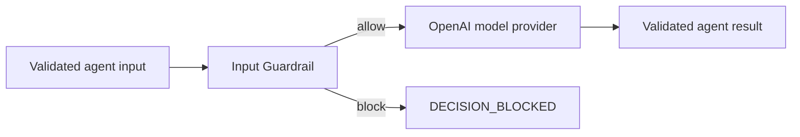

By the end of this guide, an ordinary support question reaches an OpenAI model,
while an instruction-override request stops before any model call. The
application uses Node's built-in `.env` loader; its tests replace OpenAI with a
deterministic fake.

This is the smallest complete Guardrails path:



Guardrails inspect content. They do not authenticate the caller, authorize a
business action, or isolate a process. Keep those controls at their own
application, governance, and sandbox boundaries.

## 1. Install the application dependencies

The Harness core does not enable Guardrails by default. A standalone OpenAI
application needs Harness, the provider adapter, the Guardrails addon, and its
schema library:

```bash title="Install the Guardrails application dependencies"
npm install @purista/harness @purista/harness-openai @purista/harness-guardrails zod
npm install --save-dev typescript @types/node vitest
```

If the application already has an OpenAI-backed Harness, add only
`@purista/harness-guardrails`. The tests use `@purista/harness/testing`, which
is an export of the installed Harness package and needs no provider credential.

## 2. Define one input action

An action owns one check at one lifecycle phase. This action accepts strings,
cannot transform them, and blocks one instruction-override pattern.

```ts title="examples/guardrails-quickstart/src/createSupportHarness.ts"
import { defineGuardrailAction } from '@purista/harness-guardrails'
import { z } from 'zod'

const blockInstructionOverride = defineGuardrailAction({
	phase: 'input',
	valueSchema: z.string(),
	mayTransform: false,
	evaluate: ({ value }) =>
		/ignore (all )?previous instructions/i.test(value)
			? { decision: 'block', reasonCode: 'instruction_override' }
			: { decision: 'allow' },
})
```

| Field | What to choose | Failure behavior |
| --- | --- | --- |
| `phase` | `input` because the value must be checked before instructions and the model request are built | A phase that does not match its configured flow is rejected during composition |
| `valueSchema` | The exact JSON value this action expects; here, the agent input is a string | Invalid input fails the control closed; schema issues are not exposed as inspected content |
| `mayTransform` | `false` for a pure allow/block check | Returning `transform` from this action is rejected |
| `timeoutMs` | Optional per-action upper bound; omit it to use the Guardrails default | Timeout fails closed |
| `models` | Only for actions that call registered model aliases | A missing selected alias fails composition |
| `evaluate` | A synchronous or asynchronous function returning `allow`, `block`, or an allowed transform | Throwing, cancellation, invalid output, and timeout never become `allow` |

`reasonCode` is optional. When present, use a stable content-free identifier
matching `^[a-z][a-z0-9_]{0,63}$`. Never copy the matched prompt text into it.

## 3. Put the action into an ordered flow

`defineGuardrails(...)` connects action names to ordered lifecycle flows. A flow
name is an application-owned identifier; it must match one key in `actions`.

```ts title="examples/guardrails-quickstart/src/createSupportHarness.ts"
import { defineGuardrails } from '@purista/harness-guardrails'

const supportRails = defineGuardrails({
	config: {
		rails: {
			input: { flows: ['block instruction override'] },
		},
	},
	actions: {
		'block instruction override': blockInstructionOverride,
	},
	actionTimeoutMs: 2_000,
})
```

`config.rails` defaults to an empty object, so installing the package alone
protects nothing. Each phase's `flows` array is ordered and cannot contain the
same action twice. `actionTimeoutMs` is the default budget for actions that do
not set their own `timeoutMs`; its package default is 10 seconds.

## 4. Configure the provider and bind the flow

Register the model alias before the agent, then set `guardrails: supportRails`
inside the normal inline agent definition. The production path creates the
OpenAI adapter; tests inject a `ModelProvider` without changing the agent:

```ts title="examples/guardrails-quickstart/src/createSupportHarness.ts"
import { defineHarness, inMemorySandbox, JsonLogger, type Logger, type ModelProvider } from '@purista/harness'
import { openai } from '@purista/harness-openai'
import { z } from 'zod'

function createOpenAiProvider(): ModelProvider {
	const apiKey = process.env['OPENAI_API_KEY']
	if (!apiKey) {
		throw new Error('OPENAI_API_KEY is required. Copy .env.example to .env and add your key.')
	}
	return openai({ apiKey })
}

export interface SupportHarnessOptions {
	logger?: Logger
	model?: string
	provider?: ModelProvider
}

export function createSupportHarness(options: SupportHarnessOptions = {}) {
	const provider = options.provider ?? createOpenAiProvider()

	return defineHarness({ name: 'guardrails-quickstart' })
		.logger(options.logger ?? new JsonLogger({ level: 'info' }))
		.telemetry({ contentCaptureMode: 'NO_CONTENT' })
		.sandbox(inMemorySandbox())
		.models({
			support: {
				provider,
				model: options.model ?? process.env['OPENAI_MODEL'] ?? 'gpt-5-mini',
				capabilities: ['object'],
			},
		})
		.agent('answer', {
			model: 'support',
			input: z.string().min(1).max(2_000),
			output: z.string(),
			instructions: 'Answer the support question concisely.',
			guardrails: supportRails,
		})
		.build()
}
```

The repository includes a safe template. Copy it to `.env`, then replace the
placeholder key before starting the application:

```dotenv title="examples/guardrails-quickstart/.env.example"
OPENAI_API_KEY=sk-your-key-here
OPENAI_MODEL=gpt-5-mini
```

The example's `start` script loads that file through Node itself:

```json title="examples/guardrails-quickstart/package.json"
{
  "scripts": {
    "build": "tsc -p tsconfig.json",
    "start": "node --env-file-if-exists=.env dist/index.js"
  }
}
```

`--env-file-if-exists` keeps `.env` optional when deployment already supplies
the variables. No `dotenv` package or application-level file parser is needed.

`attach(...)` supports default-loop agents because Harness owns their model and
tool lifecycle. It rejects custom-handler agents; a custom handler must call
its own checks at the release boundaries it owns. `NO_CONTENT` prevents Harness
telemetry from capturing prompt and completion content, but the application
must still review its own logs and exporters.

| Builder call | Purpose in this composition |
| --- | --- |
| [`defineHarness(...)`](/handbook/api/functions/_purista_harness.defineHarness/) | Creates the named composition root; the name is diagnostic, not an authorization scope |
| [`.logger(...)`](/handbook/api/interfaces/_purista_harness.HarnessBuilder/#logger) | Uses structured JSON logging; the tests inject a silent fake logger |
| [`.telemetry(...)`](/handbook/api/interfaces/_purista_harness.HarnessBuilder/#telemetry) | Keeps Harness prompt and completion capture disabled |
| [`.sandbox(...)`](/handbook/api/interfaces/_purista_harness.HarnessBuilder/#sandbox) | Supplies the local files-and-search sandbox; this agent enables no tools |
| [`.models(...)`](/handbook/api/interfaces/_purista_harness.HarnessBuilder/#models) | Registers the `support` alias and its `object` capability before the agent refers to it |
| [`.agent(...)`](/handbook/api/interfaces/_purista_harness.HarnessBuilder/#agent) | Registers the inline guarded agent with literal model/schema inference |
| [`.build()`](/handbook/api/interfaces/_purista_harness.HarnessBuilder/#build) | Checks model and interceptor requirements before returning the runnable Harness |

## 5. Run both paths

Run the maintained example like a normal Node/TypeScript application. The
application package owns installation and compilation; consumers do not build
the Harness or Guardrails packages themselves.

```bash title="Run the maintained Guardrails quickstart"
cd examples/guardrails-quickstart
npm install
cp .env.example .env
# Add OPENAI_API_KEY to .env before starting the live example.
npm run typecheck
npm test
npm run build
npm start
```

Expected output:

```text title="Allowed and blocked results"
allowed: <the provider's support answer>
blocked: instruction_override
```

`npm test` injects `FakeModelProvider` and needs neither `.env` nor network
access. Its decisive assertion is `provider.requests.length === 0` for the
blocked path, proving the rail ran before the provider. The live run proves the
selected provider integration; neither check measures whether the phrase
detector is good enough for real traffic. Use a reviewed evaluation dataset for
false accepts and false rejects.

The complete source is maintained in the
[Guardrails quickstart](https://github.com/puristajs/harness/tree/main/examples/guardrails-quickstart).
Continue with [configure Guardrail actions and phase order](../configure-actions-and-phase-flows/)
to add output, tool, retrieval, privacy, or model-backed checks deliberately.

API reference: [`defineGuardrailAction(...)`](/handbook/api/functions/_purista_harness-guardrails.defineGuardrailAction/),
[`defineGuardrails(...)`](/handbook/api/functions/_purista_harness-guardrails.defineGuardrails/), and
[`AgentDefinition.guardrails`](/handbook/api/types/_purista_harness.AgentDefinition/#signature).
