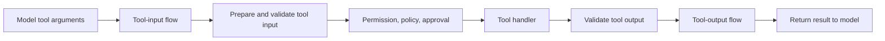

Tool rails protect two different values. A `tool_input` rail receives the
model's wire arguments before tool schema preparation, permissions, governance,
approval, and handler execution. A `tool_output` rail receives the handler
result after the tool output schema has validated it and before it returns to
the model loop.

This example removes a synthetic secret marker from a note before publication
and reduces an internal ticket result to a public status afterward.



## 1. Match the exact tool value

```ts title="src/guardrails/toolActions.ts"
import { defineGuardrailAction } from '@purista/harness-guardrails'
import { z } from 'zod'

const publishNoteWireInput = z.strictObject({
	message: z.string(),
})

export const redactPublishedNote = defineGuardrailAction<'tool_input', typeof publishNoteWireInput>({
	phase: 'tool_input',
	tools: ['publish_note'],
	valueSchema: publishNoteWireInput,
	evaluate: ({ value }) => ({
		decision: 'transform',
		target: 'tool_input',
		value: {
			...value,
			message: value.message.replaceAll('[secret]', '[redacted]'),
		},
		reasonCode: 'secret_redacted',
	}),
})
```

`tools` is required and non-empty for tool phases. It limits when the action
runs; it does not grant the agent that tool. The agent still needs
`tools: ['publish_note']`, and the handler still authorizes the business action.

The rail schema describes the wire value at this point. The registered tool
schema runs afterward and may add defaults. Keep the rail schema narrow enough
for the check, but do not expect it to coerce, default, strip, or transform a
value: Guardrails reject a schema result that differs from the protected JSON.

## 2. Protect the validated result

```ts title="src/guardrails/toolActions.ts"
const internalStatus = z.strictObject({
	status: z.string(),
	internalNote: z.string(),
})

export const exposePublicStatus = defineGuardrailAction<'tool_output', typeof internalStatus>({
	phase: 'tool_output',
	tools: ['lookup_status'],
	valueSchema: internalStatus,
	evaluate: ({ value }) => ({
		decision: 'transform',
		target: 'tool_output',
		value: {
			status: value.status,
			internalNote: '[removed]',
		},
		reasonCode: 'internal_note_removed',
	}),
})
```

The tool handler has already run at this phase. A block prevents the result
from reaching the model, but cannot roll back the handler's side effect. If
content must decide whether the effect is admitted, inspect it at `tool_input`
or enforce it with governance before the handler.

## 3. Add both actions to their flows

```ts title="src/guardrails/supportRails.ts"
export const supportRails = defineGuardrails({
	config: {
		rails: {
			tool_input: { flows: ['redact published note'] },
			tool_output: { flows: ['expose public status'] },
		},
	},
	actions: {
		'redact published note': redactPublishedNote,
		'expose public status': exposePublicStatus,
	},
})
```

The maintained
[composed Guardrails example](https://github.com/puristajs/harness/tree/main/examples/guardrails)
contains both phases, registered tools, a scripted model loop, governance,
approval, invocation, expected result, and negative tests. Read it after the
focused Guardrails quickstart; it intentionally demonstrates several controls
together.

## 4. Verify the side-effect boundary

Use a scripted provider that proposes each selected tool and instrument the
handler with a local counter. Assert:

1. transformed wire arguments are the values seen by governance, approval, and
   the handler;
2. a blocked or failed tool-input action leaves the handler count at zero;
3. invalid tool input is returned as a recoverable tool validation error;
4. the tool output schema runs before the output rail;
5. the model sees only the transformed tool result; and
6. a blocked or failed output rail does not claim that an already completed
   handler effect was rolled back.

For sensitive fields, do not recursively scan arbitrary tool JSON. Define an
explicit value schema and codec for the reviewed fields, then continue with
[select a privacy detector](../../privacy-detectors/).

API reference: [`defineGuardrailAction(...)`](/handbook/api/functions/_purista_harness-guardrails.defineGuardrailAction/)
and [`GuardrailActionDefinition`](/handbook/api/types/_purista_harness-guardrails.GuardrailActionDefinition/).
