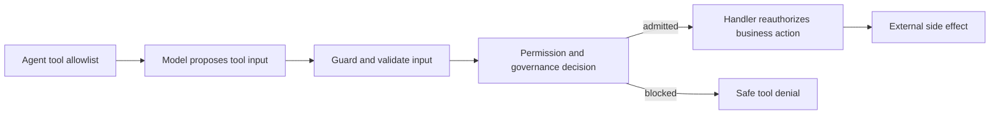

Agent governance controls whether a model-proposed tool occurrence may reach
its handler. Use it when an execution rule must be shared, reviewed, rolled out,
or audited independently of one agent prompt.

The smallest secure design still starts with a narrow tool allowlist and an
authorized handler. Governance adds a decision between them; it does not replace
either boundary.

## See the control layers

| Layer | Decides | Does not decide |
| --- | --- | --- |
| Agent `tools` / `builtinTools` | Which capabilities the model may propose | Whether one occurrence is allowed |
| Built-in permissions | Simple `bash`, `write`, and `edit` command/path behavior | Domain authorization for custom tools |
| Governance | Typed execution, exposure, approval, and audit policy | Caller identity or trusted resource ownership |
| Tool handler | Current authorization, tenant/resource access, transaction, idempotency | Model content safety |
| Guardrails | Whether exact input/output content is allowed or transformed | Whether the caller may perform the business action |
| Sandbox or remote platform | Filesystem, process, mount, network, and runtime isolation it actually implements | Business policy |

## Decide whether governance is needed

Use governance when at least one of these is true:

- the same typed rule applies to several agents or tools;
- a prepared occurrence needs a human approval before it can run;
- the model-facing tool list changes by workflow or execution context;
- a policy needs content-free decision evidence or shadow rollout; or
- an existing organization-owned policy engine must decide the occurrence.

Keep the rule in the handler when it is inseparable from the transaction or
current business authorization. Keep content inspection in Guardrails and
filesystem/process isolation in the sandbox.

## Follow the implementation path

1. [Define governance policies](./governance-policies/) to understand effects,
   defaults, runtime order, and package availability.
2. [Build the first native policy](./governance-policies/build-the-first-policy/)
   and prove a deny decision prevents the handler from running.
3. [Choose effects, defaults, and matching rules](./governance-policies/choose-effects-defaults-and-precedence/)
   before combining several controls.
4. [Hide tools and roll out policies safely](./governance-policies/hide-tools-and-roll-out-safely/)
   with exposure rules and shadow mode.
5. [Request and resume tool approval](./approval-and-audit/) and
   [record audit evidence](./record-audit-evidence/) only when the requirement
   needs those runtime dependencies.
6. [Connect Open Policy Agent](./governance-policies/connect-external-policy-engine/)
   when policy ownership is external. PURISTA ships the focused OPA Data API
   addon; Cedar and custom engines retain their own evaluator boundaries.
7. [Test governance policies](./governance-policies/test-governance-policies/)
   for every admitted, denied, unmatched, failed, cancelled, timed-out, and
   shadow path.

Native governance is included in `@purista/harness` and disabled until
`.governance(...)` is configured. Every policy callback is bounded by
`decisionTimeoutMs`; callback failure or an invalid result fails closed.

API reference: [`HarnessBuilder.governance(...)`](/handbook/api/interfaces/_purista_harness.HarnessBuilder/#governance)
and [`GovernanceConfig`](/handbook/api/interfaces/_purista_harness.GovernanceConfig/).
