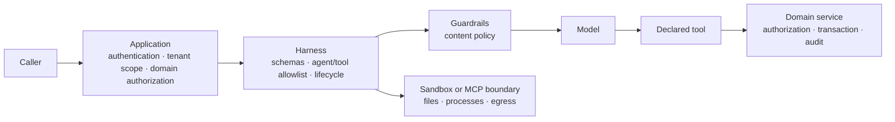

An agent is safe to expose only when each party enforces its own boundary:
the application admits and authorizes the caller, Harness constrains the
declared agent and tools, and the selected adapter or platform constrains files
and processes. Start with a model that cannot act, then enable one reviewed
capability at a time.



The model, retrieved text, and tool arguments are untrusted. A schema limits
their shape; it does not establish identity, tenant ownership, entitlement, or
approval. Keep those checks in the application service that owns the side
effect.

## Begin with a no-action agent

This composition has no built-in tools, no declared tools, no command executor,
and content-free telemetry. The deployment supplies the provider credential;
never put it in a prompt, skill, sandbox file, or source code.

```ts title="src/createTriageHarness.ts"
import { defineHarness, inMemorySandbox, type ModelProvider } from '@purista/harness'
import { z } from 'zod'

export function createTriageHarness(provider: ModelProvider) {
  return defineHarness({ name: 'support-triage' })
    .telemetry({ contentCaptureMode: 'NO_CONTENT' })
    .sandbox(inMemorySandbox()) // ephemeral files; no exec or process spawn
    .models({
      assistant: {
        provider,
        model: 'selected-in-composition',
        capabilities: ['object'],
      },
    })
    .agents(({ agent }) => ({
      triage: agent({
        model: 'assistant',
        input: z.object({ subject: z.string().min(1).max(200) }),
        output: z.object({ queue: z.enum(['billing', 'technical']) }),
        builtinTools: false,
        instructions: 'Classify the request. Do not take external action.',
      }),
    }))
    .build()
}
```

The first successful result proves only the model path. Add a tool only after
its handler can make the same domain authorization decision without trusting a
model-generated argument.

| Call or field | What it controls | Security decision |
| --- | --- | --- |
| [`defineHarness({ name })`](/handbook/api/functions/_purista_harness.defineHarness/) | Creates the named local composition root. | The name is diagnostic metadata, not a caller identity, tenant boundary, or provider credential. |
| [`.telemetry(...)`](/handbook/api/interfaces/_purista_harness.HarnessBuilder/#telemetry) | Harness trace/event capture behavior. | `NO_CONTENT` avoids prompt and completion capture. It does not remove every application log or exporter obligation. |
| [`.sandbox(...)`](/handbook/api/interfaces/_purista_harness.HarnessBuilder/#sandbox) | The sandbox adapter and its type-propagated capabilities. | The in-memory sandbox has no command/process authority; do not describe it as tenant isolation. |
| [`.models(...)`](/handbook/api/interfaces/_purista_harness.HarnessBuilder/#models) | The provider alias available to later agents. | `object` fits the schema-validating triage result. It does not grant tools, files, or caller permission. |
| [`.agents(...)`](/handbook/api/interfaces/_purista_harness.HarnessBuilder/#agents) | Registers the `triage` agent and preserves its model/schema/tool choices in the fluent type state. | Declare it after models, tools, and skills it may name. An empty tool list is not authorization; the application still authorizes every later side effect. |
| [`builtinTools: false`](/handbook/api/interfaces/_purista_harness.AgentDefinition/#builtintools) | Denies every built-in tool. | This is more explicit than an empty custom-tool list and is the correct baseline for a read-only classifier. |
| omitted [`tools`](/handbook/api/interfaces/_purista_harness.AgentDefinition/#tools) | Denies all custom tools. | Add a named allowlist only after registering the tool and implementing its own authorization. |
| [`.build()`](/handbook/api/interfaces/_purista_harness.HarnessBuilder/#build) | Validates model/tool/skill references and produces the runnable Harness. | It rejects invalid declarations before requests reach a provider; it does not replace application authentication or authorization. |

## Add the control that answers the risk

| Risk or requirement | Default | Enable and configure | Proof to keep |
| --- | --- | --- | --- |
| Input, output, retrieval, or selected tool-field content policy | No Guardrails addon | Install `@purista/harness-guardrails`, define ordered actions, and attach the rails to a default-loop agent | Allow, transform, block, timeout, and malformed-policy tests prove no model/tool call crossed a block. |
| Email, phone, card, or domain-specific sensitive-data handling | No detector | Select and install native privacy, Presidio, or local NER; bind it to the exact policy phase | Detector failure is fail-closed and telemetry contains a stable reason, not inspected content. |
| A business side effect | No tool by default | Declare a narrow input/output schema, agent allowlist, and handler that verifies principal, tenant, resource ownership, and approval | An unauthorized caller and a forged tool argument cannot perform the effect. |
| Files, command execution, or stdio MCP | Files-only in-memory sandbox | Select an adapter that declares and enforces exactly the required filesystem, exec, spawn, mount, and egress guarantees | Negative tests reject host paths, ambient credentials, forbidden commands, egress, and cross-tenant state. |
| Remote MCP | No remote connection | Install the MCP peer, configure one HTTPS endpoint and task-scoped credential | The remote server reauthorizes every request; cancellation and credential failure are safe. |

Guardrails are a content and execution control, not an authorization system.
The Harness sandbox is an adapter contract, not an automatic container or
tenant-isolation claim. An MCP server remains responsible for authentication
and authorization after Harness connects to it.

## Follow the implementation path

1. [Add guardrails](/handbook/harness/secure-and-govern/guardrails/) to configure ordered checks around a default-loop agent.
2. [Select a privacy detector](/handbook/harness/secure-and-govern/privacy-detectors/) to install and bind the detector that matches your data boundary.
3. [Choose a sandbox and MCP boundary](/handbook/harness/secure-and-govern/sandbox-and-mcp/) before enabling files, commands, local processes, or remote MCP.

Keep prompts, completions, tool arguments/results, secrets, and tenant
identifiers out of default logs and traces. Widen capture only after retention,
redaction, consent, exporter access, and incident-response policy exist.
