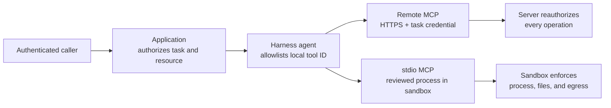

An MCP connection expands the agent's reachable system. Registering one tool
does not make its server trusted, authorize the caller, or make returned content
safe. Review the server and expose only the operation needed for the agent's
job.

Configure the transport and tool fields in
[Connect MCP tools](/handbook/harness/add-capabilities/mcp/). This page owns the
security decisions that surround that configuration.

Before enabling one MCP tool, complete five decisions: choose HTTP or stdio,
fix deployment-owned authority, minimize the request and response, define
fail-closed behavior, and verify the selected server plus its execution
boundary.

## 1. Choose the boundary before the transport

| Boundary | Prefer it when | Required controls |
| --- | --- | --- |
| Streamable HTTP MCP | A separately operated service already owns the data or side effect | HTTPS, endpoint allowlist, redirect denial, short-lived task credential, server-side authentication/authorization, rate limit, audit, timeout, and safe retry policy |
| stdio MCP | A reviewed local server must work with files or a process inside the agent workspace | Spawn-capable isolating sandbox, immutable command/package, read-only reviewed mounts, separate writable data, non-root guest, default-deny egress, resource limits, cancellation, and cleanup |

Prefer remote MCP when the service already has a strong identity and
authorization boundary. Prefer stdio only when local workspace/process access
is essential and the selected sandbox platform can enforce the required
isolation. `inMemorySandbox()` and `bashSandbox()` do not provide
`sandbox.spawn` and cannot host persistent stdio MCP.

## 2. Keep authority outside model input

The model may select only an agent-allowed local tool ID and produce arguments
that pass its declared schema. It must not choose:

- endpoint URLs, commands, packages, images, working directories, or redirects;
- credentials, tenant or principal identity, authorization scopes, or approval;
- network destinations, mounts, resource limits, or cleanup policy; or
- which remote tool names become available.

Deployment configuration selects those values. The application authenticates
the caller and authorizes the task/resource before invoking the agent. A remote
MCP server must reauthorize every request from the credential and trusted
identity context it receives; never trust a model-generated tenant or resource
ID as proof of access.

## 3. Minimize data crossing the boundary

For every tool, record the minimum request and response fields, retention,
processing region, subprocessor, and audit requirements. Use a narrow local
schema even when the remote MCP schema is broader. Do not send conversation
history, retrieved documents, sandbox files, or identity attributes unless the
specific operation requires and permits them.

Treat MCP descriptions, schemas, results, errors, and task metadata as
untrusted input. Validate result shapes before application use and run
Guardrails or domain validation at the phase that owns the decision. Do not log
credentials, headers, tool arguments/results, file content, raw server errors,
or stdio environment values.

## 4. Fail closed and clean up

| Failure | Required behavior |
| --- | --- |
| Optional MCP client is absent | Configuration or first use fails explicitly; no empty result or alternate host execution |
| Authentication or authorization fails | The tool call fails without retrying with broader credentials |
| Redirect is attempted | Reject it for credentialed endpoints unless a reviewed policy explicitly permits the destination |
| Schema or protocol response is malformed | Fail the call; never pass malformed content to the agent as success |
| Timeout or cancellation | Abort transport/process work and return the normalized failure |
| stdio process dies | Fail active work, release handles, and start a new reviewed process only for a later safe call |
| Sandbox state is missing | Raise the state-loss error; never create an empty replacement for retained work |

Retry only operations the application knows are safe and idempotent. A transport
retry cannot determine whether an upstream side effect already committed.

## 5. Verify before granting the tool

Use hermetic fake HTTP and stdio servers to cover tool listing/call, protocol
headers, authentication failure, malformed schemas/results, timeout,
cancellation, task polling/cancellation where supported, process death, and
shutdown cleanup. Then run a selected-server integration test with synthetic
data and bounded credentials.

For stdio, also run the sandbox contract and platform negative tests for host
paths, cross-tenant files, package mutation, ambient credentials, forbidden
egress, resource limits, stale attachments, and orphan cleanup. A passing MCP
protocol test does not prove sandbox isolation, and a passing sandbox contract
does not prove the MCP server's authorization logic.
