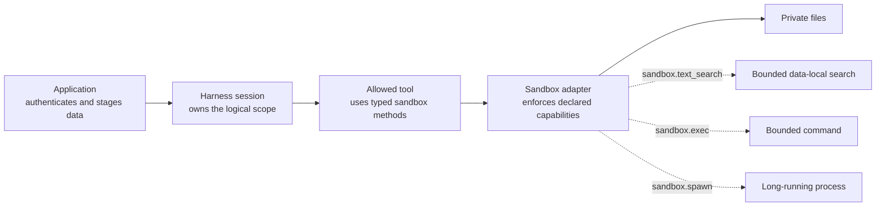

A sandbox gives one Harness session a logical filesystem, optional bounded
text search and, only when the selected adapter declares it, command or long-running process execution. It is
not authentication, business authorization, a secret manager, or automatically
a container or microVM. Start with files only and add execution only for a use
case that needs it.

The smallest path in this guide registers `inMemorySandbox()`, proves that a
tool can use only file operations, and keeps command/process execution absent
from its handler type. Add an executable adapter only after that boundary is
insufficient for the use case.



The application decides which principal may start the work and which data may
enter the sandbox. Harness owns the session lifecycle and exposes only the
selected adapter's declared operations. The adapter owns filesystem,
isolation, resource, network, and cleanup enforcement. A filename schema or a
tool allowlist does not replace those decisions.

## 1. Choose the smallest capability set

| Option | Available by default | Capabilities | Use it for | Do not use it as |
| --- | --- | --- | --- | --- |
| [`inMemorySandbox()`](/handbook/api/functions/_purista_harness.inMemorySandbox/) | Yes | `sandbox.fs`, `sandbox.text_search` | Staged files, bounded search, skills, deterministic local tests | Durable storage, command execution, or tenant isolation |
| [`bashSandbox()`](/handbook/api/functions/_purista_harness.bashSandbox/) | Factory is included; `just-bash` is optional | `sandbox.fs`, `sandbox.text_search`, `sandbox.exec` | Trusted local transformations with an emulated shell | A container, VM, or stdio-process boundary |
| Local durable execution | Yes, explicitly configured | Persistent host directory and bounded search; host execution is opt-in | Trusted single-host recovery | Isolation for untrusted model-directed code |
| [Local Docker or OrbStack adapter](/handbook/harness/secure-and-govern/local-docker-sandbox/) | Separate first-party package | `sandbox.fs`, `sandbox.text_search`, `sandbox.exec`, `sandbox.spawn` | Trusted local Linux tooling, guest-local search, and stdio development | Hostile multi-tenancy or durable-workspace recovery |
| [Kubernetes sandbox](/handbook/harness/secure-and-govern/kubernetes-sandbox/) | Separate first-party package | Restricted pod filesystem, data-local search, bounded execution, persistent PVC; optional durable workspace binding | Self-hosted multi-instance execution and PVC snapshot recovery | A substitute for cluster RBAC, admission, egress, image, quota, or CSI policy |
| Application-owned adapter | Core port | Only what its platform enforces | A different container, microVM, or remote execution service | Capabilities asserted only through TypeScript |

If `.sandbox()` is omitted or called without an adapter, Harness tries
`bashSandbox()` and falls back to `inMemorySandbox()` only when `just-bash` is
not installed. Prefer an explicit adapter in application code and tests: it
makes the security boundary and available tool types independent of the host's
installed packages.

## 2. Start with files only

The application stages reviewed claim evidence. The agent can call one narrow
tool that reads only the selected file from its session workspace.

```ts title="src/harness/claimsReviewHarness.ts"
import { defineHarness, inMemorySandbox, type ModelProvider } from '@purista/harness'
import { z } from 'zod'

const claimInput = z.object({ filename: z.string().regex(/^[a-z0-9._-]+$/i) })
const claimOutput = z.object({ decision: z.enum(['accept', 'review']) })

export function createClaimsReviewHarness(provider: ModelProvider) {
	return defineHarness({ name: 'claims-review' })
		.sandbox(inMemorySandbox())
		.models({
			reviewer: { provider, model: 'reviewer', capabilities: ['object', 'tool_use'] },
		})
		.tool('read_claim_evidence', {
				description: 'Read one application-authorized claim evidence file.',
				input: claimInput,
				output: z.object({ text: z.string().max(20_000) }),
				handler: async (context, { filename }) => ({
					text: await context.sandbox.readText(`/workspace/evidence/${filename}`),
				}),
		})
		.agent('review_claim', {
			model: 'reviewer',
			input: claimInput,
			output: claimOutput,
			tools: ['read_claim_evidence'],
			instructions: 'Read the staged evidence and return the declared decision.',
		})
		.build()
}
```

Register the sandbox before tools so `context.sandbox` carries its precise
capability type. `inMemorySandbox()` has no `exec` method on that type. The
agent receives the tool only because its definition explicitly lists
`read_claim_evidence`; registering a tool does not grant it to every agent.

The composition uses [`defineHarness(...)`](/handbook/api/functions/_purista_harness.defineHarness/),
[`.sandbox(...)`](/handbook/api/interfaces/_purista_harness.HarnessBuilder/#sandbox),
[`.models(...)`](/handbook/api/interfaces/_purista_harness.HarnessBuilder/#models),
[`.tool(...)`](/handbook/api/interfaces/_purista_harness.HarnessBuilder/#tool),
[`.agent(...)`](/handbook/api/interfaces/_purista_harness.HarnessBuilder/#agent),
and [`.build()`](/handbook/api/interfaces/_purista_harness.HarnessBuilder/#build).
The focused [tool guide](/handbook/harness/add-capabilities/tools/) owns tool
definition options; this page owns how sandbox selection changes that handler
context and security boundary.

The application must write the authorized file before invoking the agent. Keep
all sandbox paths absolute and POSIX-style. The reserved roots are:

| Path | Owner and purpose |
| --- | --- |
| `/workspace/` | Agent and tool scratch files |
| `/skills/<id>/` | Harness-mounted skill content; treat it as read-only |
| `/memory/session/` and `/memory/runs/` | Files used by the default sandbox-backed memory adapter |

Relative paths fail with `SandboxError` and `reason: 'invalid_path'`. A missing
file, closed attachment, or adapter failure also fails the tool call; Harness
does not turn it into empty content.

## 3. Add bounded command execution

Choose `bashSandbox()` only when a reviewed tool must execute a command. Install
its optional peer in the application:

```sh title="Install the emulated bash runtime"
npm install just-bash
```

Without this package, constructing `bashSandbox()` fails synchronously with a
`HarnessConfigError` whose reason is `just_bash_not_installed`.

```ts title="src/harness/createReportSandbox.ts"
import { bashSandbox } from '@purista/harness'

export const reportSandbox = bashSandbox({
	network: { allow: ['https://reports.internal.example/'] },
	executionLimits: {
		wallClockMs: 15_000,
		maxFileSystemBytes: 8 * 1024 * 1024,
	},
	python: false,
})
```

| Option | Default | Effect |
| --- | --- | --- |
| `network.allow` | `[]` | Reviewed URL prefixes the emulator may access; network is denied when the list is empty |
| `executionLimits.wallClockMs` | Harness tool timeout | Upper bound for one emulated command |
| `executionLimits.maxFileSystemBytes` | Adapter default | Bounds files in the emulator; it is not a host-memory quota |
| `python` | `false` | Enables the emulator's Python builtin when supported by the installed peer |

Unknown fields and invalid limits are rejected. `exec(command, options)` uses
`/workspace` by default and accepts `cwd`, a narrow environment map, `stdin`,
`timeoutMs`, and `signal`. A timeout becomes `OperationTimeoutError`; an abort
becomes `OperationCancelledError`. The built-in `bash` tool is disabled when
the selected sandbox has no executor.

Built-in `grep` is different: it requires `sandbox.text_search`, which both
built-in sandboxes provide without configuration. It executes bounded literal
or case-sensitive ASCII-pattern `safe_regex_v1` matching at the sandbox boundary. Results carry `complete`
and `limitReasons`; narrow and retry an incomplete result instead of treating
it as exhaustive. A custom adapter without the capability fails during
`.build()` when an agent enables `grep`.

`bashSandbox()` does not support `sandbox.spawn`. It therefore cannot host a
persistent stdio server. For separately operated HTTP or sandboxed stdio tools,
follow [Connect MCP tools](/handbook/harness/add-capabilities/mcp/); that page
owns transport configuration, authentication, and MCP-specific failures.

## 4. Understand attach, release, and recovery

| Operation | Result |
| --- | --- |
| `create` | Allocates a previously unseen logical scope; concurrent creation of that exact scope is idempotent |
| `attach` | Opens another attachment to retained state; it never creates missing state |
| `restore` | Reopens a run only after compatible durable-workspace recovery has been authorized |
| `SandboxSession.close()` | Detaches and invalidates that handle without promising logical deletion |
| `session.release()` | Releases the Harness attachment while retaining the session record and supported sandbox state |
| `session.destroy()` | Terminates owned sandbox state before deleting the Harness session record |

Harness derives the scope from persisted session and run identity. Adapter
provider references, generations, leases, and cleanup metadata remain private.
When retained state is missing, the runtime raises `SandboxStateLostError`
instead of silently creating an empty workspace. Snapshot capability alone is
not durable recovery; use a compatible
[durable workspace](/handbook/harness/manage-context-and-state/durable-workspaces/)
for committed replay.

## 5. Test the behavior and the adapter separately

Use `FakeSandbox` for application control-flow tests and the shared contract for
an adapter implementation. Neither proves a provider's process or tenant
isolation by itself.

```ts title="src/adapters/reportSandbox.test.ts"
import { bashSandbox, inMemorySandbox } from '@purista/harness'
import { sandboxContract, sandboxTextSearchContract } from '@purista/harness/testing'

sandboxContract(() => inMemorySandbox(), { executor: 'unavailable' })
sandboxContract(() => bashSandbox(), { executor: 'available' })
sandboxTextSearchContract(() => inMemorySandbox())
sandboxTextSearchContract(() => bashSandbox())
```

Run the matching contract against every custom adapter, then add platform tests
for boundaries the generic suite cannot observe: host-path denial, tenant
separation, image provenance, default-deny egress, CPU/memory/PID/disk limits,
credential injection, timeout, cancellation, stale attachments, and cleanup
after provider failure.

Before production use, document who authorizes owner registration and cleanup,
how orphaned resources are reconciled, and which team owns provider outages.
Keep identities, paths, commands, file content, provider references, cursors,
and snapshots out of normal logs and telemetry.

For an application-owned backend, continue with
[build a custom sandbox adapter](../custom-sandbox-adapter/) and
[test sandbox isolation and lifecycle](../test-sandbox-isolation/).
For the first-party production path, continue with
[run a Kubernetes sandbox](../kubernetes-sandbox/).
