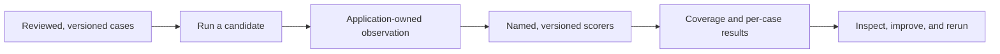

Use two complementary signals. Deterministic fakes and adapters prove schemas,
wiring, tools, workflows, retries, cancellation, and persistence. They cannot
establish the factual quality of nondeterministic model output. Evaluations run
reviewed cases through a candidate system, apply explicit scorers, and show
where the system improved or failed.

An evaluation is not a unit test with a model call. It is a measurement loop:

The Harness runs and scores in process. Your application owns the dataset,
candidate configuration, observation retention, access control, release policy,
and any external platform. A result deliberately does not contain raw task
inputs, references, outputs, or judge context.

Start with a small suite that represents the decision you need to make—not a
large but unreviewed collection. Include normal, failure, ambiguous, and
high-risk cases. A small suite is a useful diagnostic baseline; it is not proof
of reliability or a universal release threshold.

| Need | Start here |
| --- | --- |
| Choose the correct deterministic test boundary | [Test Harness applications deterministically](/handbook/harness/test-and-evaluate/test-harness-applications/) |
| Prove tool calls and multi-round agent behavior | [Test agent tools](/handbook/harness/test-and-evaluate/test-agent-tools/) |
| Prove workflow coordination, events, and recovery | [Test workflows](/handbook/harness/test-and-evaluate/test-workflows/) |
| Verify a custom storage, sandbox, workspace, or provider adapter | [Test adapters](/handbook/harness/test-and-evaluate/test-adapters/) |
| Build one baseline, inspect a failure, and rerun it | [Run your first evaluation](/handbook/harness/test-and-evaluate/evaluate-prompts-and-outputs/) |
| Design reviewed data and make CI policy explicit | [Build evaluation datasets and run them in CI](/handbook/harness/test-and-evaluate/evaluation-datasets-and-ci/) |
| Decide how a result is judged | [Choose and calibrate scorers](/handbook/harness/test-and-evaluate/choose-and-calibrate-scorers/) |
| Measure a specific AI system shape | [Evaluation recipes](/handbook/harness/test-and-evaluate/recipes/) |
| Compare versions, control spend, or export results | [Compare results and diagnose regressions](/handbook/harness/test-and-evaluate/compare-and-diagnose-regressions/) |

Keep tests and evaluations connected. Tests should cover allowed, denied,
timed-out, malformed, cancelled, and replay paths. Evaluations should expose
quality failures that those deterministic tests cannot answer. In both paths,
keep prompts, tool payloads, sensitive data, and secrets out of fixtures,
telemetry, logs, snapshots, and failure values.
