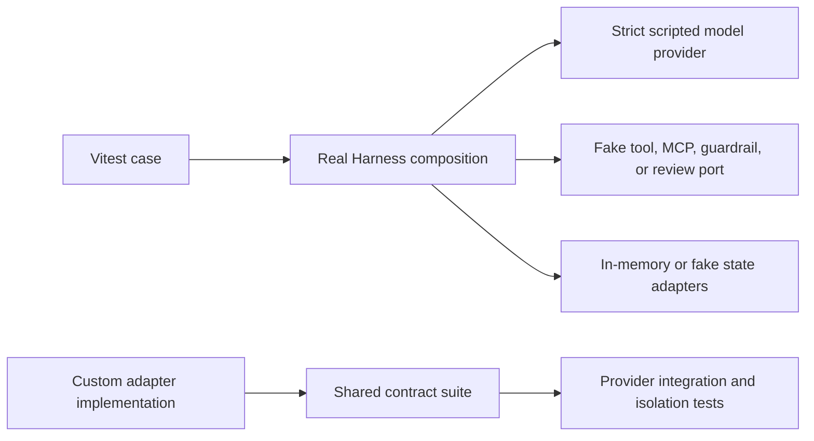

Deterministic tests prove the implementation around AI: typed contracts,
selected capabilities, tool calls, workflow order, cancellation, retries,
persistence, and failure handling. Replace nondeterministic or external
boundaries with scripted providers and adapters, then run the real Harness code
that coordinates them.

They do not prove that a live agent is factually correct, helpful, grounded, or
safe for representative input. Measure those properties with reviewed datasets
and [evaluations](/handbook/harness/test-and-evaluate/evaluate-prompts-and-outputs/).

## Test the closest useful boundary

| What you need to prove | Test boundary | Continue with |
| --- | --- | --- |
| One input, model request, and validated output | Strict `FakeModelProvider` through a real session | [Test a basic agent](/handbook/harness/build-agents/test-a-basic-agent/) |
| Tool arguments, tool results, loop order, permission, and failures | Scripted provider plus injected tool dependency | [Test agent tools](/handbook/harness/test-and-evaluate/test-agent-tools/) |
| Fan-out, steps, child tasks, review, retries, cancellation, and events | Real workflow with deterministic agents/adapters | [Test workflows](/handbook/harness/test-and-evaluate/test-workflows/) |
| A custom storage, memory, workspace, sandbox, logger, or provider port | Matching shared contract suite plus provider integration tests | [Test adapters](/handbook/harness/test-and-evaluate/test-adapters/) |
| Prompt quality or live-agent correctness | Reviewed cases, versioned scorers, repeated trials | [Run your first evaluation](/handbook/harness/test-and-evaluate/evaluate-prompts-and-outputs/) |

## Use strict scripted model responses

[`FakeModelProvider`](/handbook/api/classes/_purista_harness_testing.FakeModelProvider/)
implements the normal provider port without credentials or network access.
Construct a new instance for each test.

| Method | Scripts the next |
| --- | --- |
| [`enqueueText(response)`](/handbook/api/classes/_purista_harness_testing.FakeModelProvider/#enqueuetext) | Text result |
| [`enqueueObject(response)`](/handbook/api/classes/_purista_harness_testing.FakeModelProvider/#enqueueobject) | Structured result or tool-call round |
| [`enqueueTextStream(chunks)`](/handbook/api/classes/_purista_harness_testing.FakeModelProvider/#enqueuetextstream) | Text stream |
| [`enqueueObjectStream(chunks)`](/handbook/api/classes/_purista_harness_testing.FakeModelProvider/#enqueueobjectstream) | Structured stream |
| [`enqueueEmbedding(response)`](/handbook/api/classes/_purista_harness_testing.FakeModelProvider/#enqueueembedding) | Embedding request |
| [`enqueueRerank(response)`](/handbook/api/classes/_purista_harness_testing.FakeModelProvider/#enqueuererank) | Reranking request |

For application tests, enable `{ strict: true }`. An unqueued request or a
response queued for a different operation fails immediately. After the
interaction, inspect `provider.requests` only for details relevant to the
behavior and call `provider.assertExhausted()` to detect unused fixtures.
See the exact [`assertExhausted()` contract](/handbook/api/classes/_purista_harness_testing.FakeModelProvider/#assertexhausted).

Do not assert the complete provider request object by default. Exact snapshots
of prompts, generated schemas, headers, or tool payloads are noisy, may contain
sensitive content, and couple a test to unrelated formatting. Prefer narrow
assertions such as the request count, selected operation, tool name, or one
required projected message.

## Cover the unhappy path deliberately

For each capability, start with one successful test and add only the failures
that change application behavior:

- invalid caller input and invalid provider output;
- denied, malformed, timed-out, cancelled, or failed tool calls;
- model loop and workflow budgets;
- retry exhaustion and non-retriable errors;
- concurrent session use and idempotency conflict;
- missing retained sandbox or workspace state;
- malformed review decisions and expired waits; and
- storage, event persistence, or cleanup failure.

Use normalized error codes or public error classes as assertions. Never place
raw prompts, credentials, personal data, tool payloads, or provider diagnostics
in test names, snapshots, error messages, or CI artifacts.

## Keep real integrations explicit

An optional live-provider smoke test can prove credentials, network routing,
the selected provider adapter, and one bounded model operation. Run it in a
separately labeled environment with budget, timeout, redaction, and secret
controls. Do not make it the only test for application logic, and do not treat
one successful response as a quality threshold.

Adapter contract suites are likewise necessary but not sufficient. A generic
sandbox contract can prove lifecycle and file/exec behavior; only platform
tests can prove container, VM, network, quota, and tenant-isolation claims.
