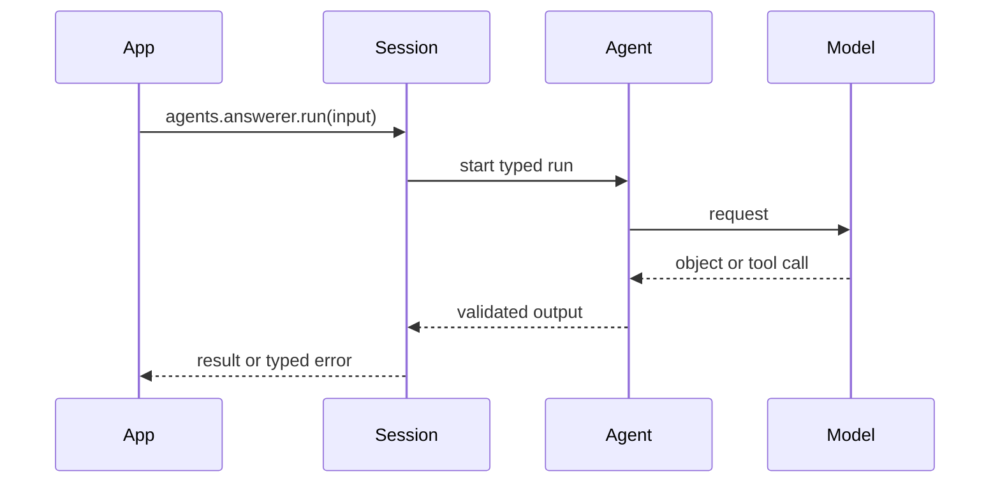

An agent accepts validated input, builds a model request, may execute permitted
tools, validates its final output, and emits typed run events. A session provides
the operational context for that run: history, memory, sandbox resources, and
one active run at a time.

Use distinct session IDs for concurrent user threads. A second active run on one
session is rejected; a session is not a queue. Use an application queue/worker
when work must wait or survive process restart.

`session.release()` closes live sandbox/MCP resources while retaining persisted
history and runs. `session.destroy()` destructively closes the session and removes
persisted session data. Choose deliberately; neither substitutes for a business
retention policy.
