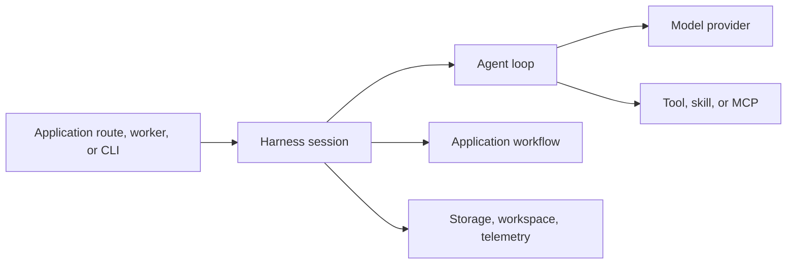

Harness is an in-process runtime, not an AI hosting platform. It gives an
application a typed boundary around model calls and agent execution while the
application retains authority over identity, business policy, infrastructure,
and deployment.

1. [Mental model and runtime architecture](/handbook/harness/understand-the-harness/mental-model-and-runtime-architecture/)
2. [Agents, sessions, and lifecycle](/handbook/harness/understand-the-harness/agents-sessions-and-lifecycle/)
3. [Workflows and tasks](/handbook/harness/understand-the-harness/workflows-and-tasks/)
4. [Capabilities and extension points](/handbook/harness/understand-the-harness/capabilities-and-extension-points/)
5. [Context, memory, and persistence](/handbook/harness/understand-the-harness/context-memory-and-persistence/)
6. [Failure and durability model](/handbook/harness/understand-the-harness/failure-and-durability-model/)
