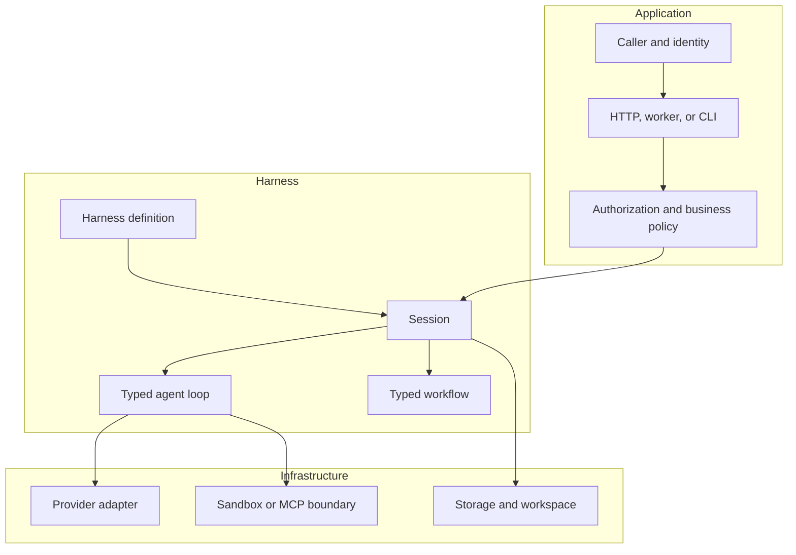

The Harness compiles definitions for models, tools, skills, agents, workflows,
and adapters. A session then executes one run at a time through those
definitions. It does not become your API gateway, identity provider, queue,
database, secret manager, or policy authority.

| Use an agent when | Use a workflow when |
| --- | --- |
| One model-driven conversation can complete the task, possibly with tools | The application must sequence agents, branch, fan out, persist a step, request review, or perform a domain side effect |

An agent owns the model/tool loop. A workflow owns deterministic orchestration
around agents. Do not encode a business approval or database mutation solely in
model instructions.
