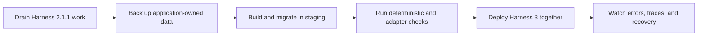

The migration baseline is `@purista/harness@2.1.1`, verified as npm's latest
published release on 31 August 2026 and matched to the
[GitHub v2.1.1 source tag](https://github.com/puristajs/harness/tree/v2.1.1).
The target described here is the current Harness 3
contract. Until the 3.0 packages are published, use this guide to prepare and
test a branch—not as evidence that a production release is available.

## Choose the path you need

| Need | Guide |
| --- | --- |
| Update application source to the current clean-break Harness 3 API | [Adopt the Harness 3 clean-break API](./migrate-to-v3/) |
| Decide what can be copied, converted, reindexed, or must start clean | [Migrate adapters and data](./adapter-and-data-compatibility/) |
| Stage the rollout, prove recovery, and retain a real rollback path | [Verify rollout and rollback](./verification-and-rollback/) |

## Treat the upgrade as a clean boundary

Harness 3 replaces the 2.1.1 durability, memory, sandbox, and decision contracts
without compatibility shims. MCP v2 transport requirements, additive registry
registration, and `session.release()` already exist in 2.1.1. A mixed
installation is not supported:
keep all `@purista/harness*` packages on the same major and rebuild application
code against the new types.

Do not let Harness 2.1.1 workers process Harness 3 durable records, or Harness 3
workers open a 2.1.1 SQLite runtime database. Rollback means restoring the old
binary with its matching data snapshot—not asking one version to interpret the
other version's records.

Before editing, create an inventory of:

- every installed `@purista/harness*` package and optional peer;
- every `.state`, `.runtime`, `.workspaceStore`, `.checkpoints`, `.memory`,
  `.sandbox`, `.tools`, `.governance`, and MCP registration, plus any
  application-owned content controls;
- active durable runs, waits, workspace checkpoints, memory indexes, and plugin
  digests;
- deployment entry points, worker drain controls, backups, and rollback owner.

Start with the [source migration](./migrate-to-v3/), then make each storage and
adapter decision before running the rollout checklist.
