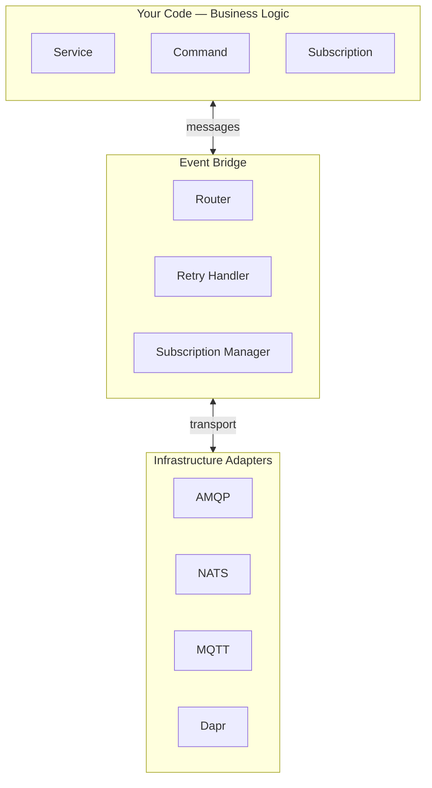
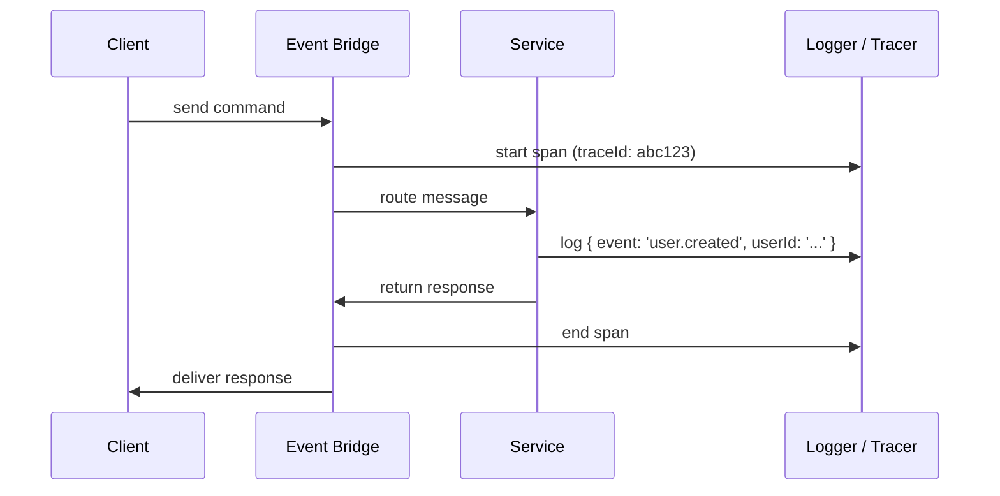
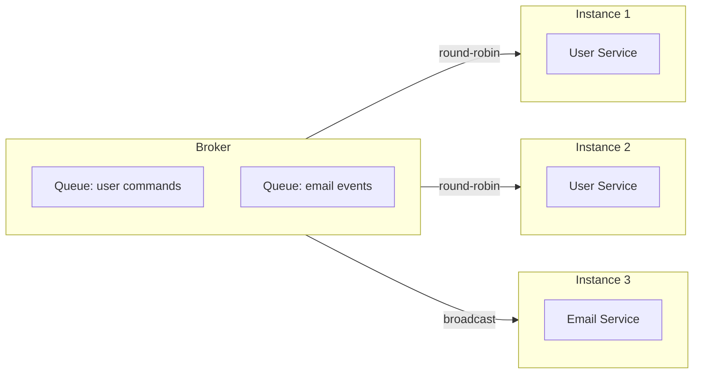

# Principles of PURISTA

PURISTA is opinionated so your team does not have to be. These eight principles guide every API design decision, every code generation template, and every deployment recommendation.

## At a glance

| # | Principle | What it means for you |
|---|-----------|----------------------|
| 1 | [Focus on business logic](#1-focus-on-business-logic) | Write business operations, not boilerplate |
| 2 | [Strict separation](#2-strict-separation-of-concerns) | Infrastructure never leaks into business code |
| 3 | [Stateless by design](#3-stateless-by-design) | Scale horizontally by adding instances |
| 4 | [Configuration over convention](#4-configuration-over-convention) | Everything is explicit and reviewable |
| 5 | [Validated data handling](#5-validated-data-handling) | Types and validation at every boundary |
| 6 | [Built-in observability](#6-built-in-observability) | Traces, logs, and metrics without instrumentation |
| 7 | [Performance via scaling](#7-performance-via-scaling) | Add instances, not complexity |
| 8 | [Decouple from infrastructure](#8-decouple-from-infrastructure) | Run anywhere, change anytime |

---

## 1. Focus on business logic

PURISTA handles the infrastructure glue — serialization, routing, retries, tracing, schema validation — so you write business operations, not boilerplate.

```typescript [before.ts]
// Traditional: you write HTTP routing, validation, error handling, logging
app.post('/api/users', async (req, res) => {
  try {
    const body = req.body
    if (!body.email || !body.password) {
      return res.status(400).json({ error: 'invalid input' })
    }
    const user = await db.createUser(body)
    logger.info('user created', user.id)
    res.json({ userId: user.id })
  } catch (err) {
    logger.error(err)
    res.status(500).json({ error: 'internal error' })
  }
})
```

```typescript [after.ts]
// PURISTA: you write the business operation
export const userSignUpCommandBuilder = userServiceBuilder
  .getCommandBuilder('userSignUp', 'register a new user')
  .addPayloadSchema(z.object({ email: z.string().email(), password: z.string().min(8) }))
  .setCommandFunction(async function (context, payload) {
    const userId = await context.resources.db.createUser(payload)
    context.logger.info({ userId }, 'user created')
    return { userId }
  })
```

The framework generates the HTTP endpoint, validates input, handles errors, emits traces, and returns typed responses.

---

## 2. Strict separation of concerns

Business logic is isolated from the outside world. Services interact with infrastructure only through well-defined interfaces.



This three-layer architecture means:

- **Business logic** never imports an HTTP client, message broker SDK, or database driver directly
- **Event bridge** abstracts routing, retries, and subscriptions
- **Adapters** connect the bridge to specific brokers

You can swap AMQP for NATS without touching a line of business logic.

---

## 3. Stateless by design

Services hold no shared state. Every request carries its own context. This makes horizontal scaling trivial.

```typescript
// ❌ Stateful: shared memory between requests
let requestCount = 0

// ✅ Stateless: everything is in the context
.setCommandFunction(async function (context, payload) {
  const count = await context.resources.cache.increment('requests')
  return { count }
})
```

| Stateful | Stateless |
|---|---|
| In-memory caches | External cache stores (Redis, etc.) |
| Session affinity required | Any instance can handle any request |
| Hard to scale | Scale by adding instances |
| Complex failover | Instances are interchangeable |

PURISTA provides config stores, secret stores, and state stores for externalized state management.

---

## 4. Configuration over convention

Everything is explicit. No magic folder scanning, no implicit behavior that breaks in production.

```typescript [purista.json]
{
  "$schema": "https://purista.dev/schemas/1.12.0/schema.json",
  "runtime": "node",
  "eventBridge": "nats",
  "fileConvention": "kebab",
  "eventConvention": "camel",
  "servicePath": "src/services"
}
```

| What | Where it lives | Why explicit |
|---|---|---|
| Service name | `serviceInfo.serviceName` | Renaming is a conscious change |
| Command contracts | Builder methods (`.addPayloadSchema`, `.addOutputSchema`) | Types propagate through the system |
| Retry policy | Per-command or per-subscription config | Different operations need different guarantees |
| Event bridge | `purista.json` + bootstrap code | Switching brokers is a single change |
| HTTP exposure | `.exposeAsHttpEndpoint()` on the builder | Not every command is a public API |

---

## 5. Validated data handling

Every input and output is schema-validated at the boundary. TypeScript types propagate through the entire call chain.

```typescript
const inputSchema = z.object({
  email: z.string().email(),
  age: z.number().min(18),
})

const outputSchema = z.object({
  userId: z.string().uuid(),
})

const builder = serviceBuilder
  .getCommandBuilder('createUser', 'create a user')
  .addPayloadSchema(inputSchema)
  .addOutputSchema(outputSchema)
  .setCommandFunction(async function (context, payload) {
    // `payload` is typed as { email: string; age: number }
    // Returning { userId: string } is enforced by the compiler
    const userId = await db.create(payload)
    return { userId }
  })
```

What validation gives you:

- **Runtime safety** — malformed input never reaches your business logic
- **Compile-time confidence** — TypeScript knows the shape of every message
- **Auto-generated docs** — OpenAPI schemas are derived from Zod definitions
- **Refactoring safety** — change a schema and the compiler shows every affected consumer

---

## 6. Built-in observability

OpenTelemetry traces, structured logging, and metrics are first-class citizens — not afterthoughts.



Every message carries:

- `traceId` — correlates the entire distributed flow
- `span context` — timing and metadata for each hop
- `structured logs` — JSON logs with correlation IDs built in

Configure tracing explicitly on every runtime instance that emits spans. Reuse
one application-owned configuration object when the service and event bridge
intentionally share a pipeline:

```typescript [main.ts]
import { OTLPTraceExporter } from '@opentelemetry/exporter-trace-otlp-http'
import { SimpleSpanProcessor } from '@opentelemetry/sdk-trace-node'
import { AmqpBridge } from '@purista/amqpbridge'

const spanProcessor = new SimpleSpanProcessor(
  new OTLPTraceExporter({ url: 'http://localhost:4318/v1/traces' })
)

const runtimeObservability = { spanProcessor }
const eventBridge = new AmqpBridge(runtimeObservability)
const myService = await myV1Service.getInstance(eventBridge, {
  ...runtimeObservability,
})
await eventBridge.start()
```

No custom instrumentation in your commands or subscriptions.

---

## 7. Performance via scaling

Performance comes from running more service instances, not from writing faster code.



Because services are stateless:

- The broker distributes messages across instances
- You scale individual services independently
- No session affinity, no sticky routing, no distributed state headaches
- Slow operations use queues and workers instead of blocking request handlers

---

## 8. Decouple from infrastructure

Your business logic is portable. The same service code runs on a laptop, in a container, or on the edge.

```typescript [local.ts]
// Local development — no broker needed
import { DefaultEventBridge } from '@purista/core'
const eventBridge = new DefaultEventBridge()
```

```typescript [production.ts]
// Production — swap to NATS
import { NatsBridge } from '@purista/natsbridge'
const eventBridge = new NatsBridge({ ... })
```

The service code does not change. Only the bootstrap file that creates the event bridge instance changes.

| Environment | Event Bridge | Queue Bridge | Store |
|---|---|---|---|
| Local dev | `DefaultEventBridge` (in-memory) | `DefaultQueueBridge` | `DefaultStateStore` |
| CI / testing | `DefaultEventBridge` or Redis | `DefaultQueueBridge` | `DefaultStateStore` |
| Production (containers) | `AMQPBridge` or `NatsBridge` | `RedisQueueBridge` | `RedisStateStore` |
| Serverless | `DefaultEventBridge` | `redis-queue-bridge` | `aws-config-store` |
| Edge / IoT | `MqttBridge` | MQTT-native | Dapr state store |

---

## Summary

These principles work together:

1. **Focus on business logic** → you write less code
2. **Strict separation** → your code is testable and portable
3. **Stateless** → scaling is trivial
4. **Explicit configuration** → behavior is predictable and reviewable
5. **Validated data** → bugs are caught at the boundary
6. **Observability built in** → production issues are debuggable
7. **Scale out** → performance is a deployment concern, not a code concern
8. **Decoupled infrastructure** → you can adapt to changing requirements

Next: see these principles in action with the [Quickstart](./1_quickstart/index.md), or read [From Zero to Production](./from-zero-to-production.md) for the deployment path.
