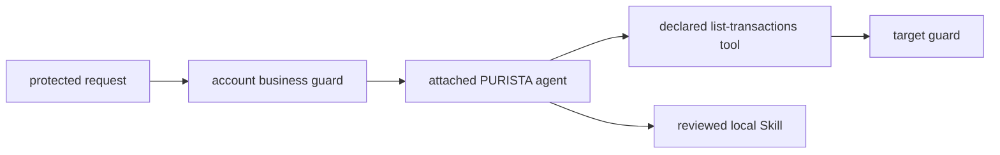

This chapter builds an agent *inside* a PURISTA service. It is not a separate
Harness application. The agent starts with no banking permission; application
code gives it one declared, read-only command tool and one reviewed instruction
file.



Use the CLI-created `banking-support` service. Create it when starting here:

```bash title="Generate the support service and first agent"
npm run add:service -- banking-support --description "Read-only banking customer support"
npm run add:agent -- classify-customer-support \
  --service banking-support --service-version 1 \
  --description "Classify one authorized customer support request"
```

The CLI creates the agent builder and test under
`src/service/bankingSupport/v1/agent/classifyCustomerSupport/`, then adds the
definition to the service. Run its generated test before changing its schemas.
The finished local checkpoint is in `examples/banking/src/ai/`.

1. [Declare one guarded command tool](/tutorials/agent-integrations/expose-bank-tool/)
2. [Keep the tool read-only and bounded](/tutorials/agent-integrations/limit-tools/)
3. [Add a reviewed support Skill](/tutorials/agent-integrations/add-playbook/)
4. [Test access and missing dependencies](/tutorials/agent-integrations/test-integrations/)
5. [Understand the current MCP and Plugin boundary](/tutorials/agent-integrations/current-boundary/)
