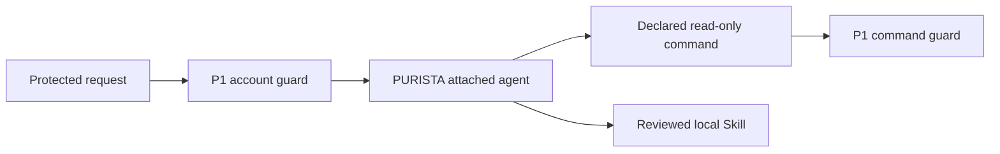

An agent needs less authority than the application around it. This chapter gives
two small agents separate, bounded capabilities: a classifier may call one
read-only PURISTA command, and a support guide may read one reviewed local
Skill before it answers.



The model cannot choose another person, account, or command. The command tool
uses the already-validated account from the request and the original PURISTA
identity. A Skill provides instructions only; it never gives the agent a new
tool or business permission.

Run both focused proofs from the repository root:

```bash
npx vitest run examples/banking/src/ai/customer-support-classification.test.ts
npx vitest run examples/banking/src/ai/support-playbook.test.ts
```

These are isolated Hono service tests with scripted models. They do not expose
the agents in the main banking UI and do not call a live model.

1. [Declare one guarded command tool](/tutorials/agent-integrations/expose-bank-tool/)
2. [Keep the tool read-only and bounded](/tutorials/agent-integrations/limit-tools/)
3. [Add a reviewed support Skill](/tutorials/agent-integrations/add-playbook/)
4. [Test access and missing dependencies](/tutorials/agent-integrations/test-integrations/)
5. [Understand the current MCP and Plugin boundary](/tutorials/agent-integrations/current-boundary/)
