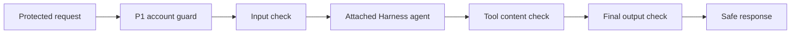

An assistant can be allowed to answer a question and still receive unsafe text.
That text can come from the caller, a retrieved document, a tool, or the model
itself. This chapter puts a small check at each boundary and stops the run when
the synthetic test data is unsafe.



The account guard is still the first control. It decides whether Bob may ask
about Account A. Content checks do not grant access and cannot repair a
document that was retrieved outside the caller's scope.

## Create the attached agent first

Start with a CLI-created service and agent. This keeps the content checks in
the same PURISTA service boundary as the account guard, HTTP endpoint, and
tests.

```bash title="Generate the guarded assistant scaffold"
npm run add:service -- banking-guarded-assistant \
  --description "Scoped banking assistant with content boundaries"
npm run add:agent -- answer-with-content-boundaries \
  --service banking-guarded-assistant --service-version 1 \
  --description "Answer a scoped support question through content checks"
```

The generated agent builder and test are the starting point. Replace their
starter schemas, add the account business guard, then add the native Harness
interceptors in the following pages. The runnable checkpoint is
`examples/banking/src/ai/guarded-assistant.ts`.

The example uses native Harness `interceptors` through a PURISTA attached
agent. Its markers such as `BANK_DEMO_SECRET` are deliberately synthetic. They
prove the runtime order; they are **not** a production content-moderation or
prompt-injection solution. The optional `@purista/harness-guardrails` package
is not currently published on npm.

Run the complete local proof from the repository root:

```bash title="Run the guardrail boundary test"
npx vitest run examples/banking/src/ai/guarded-assistant.test.ts
```

This is an isolated Hono service test. The main banking UI does not expose the
guarded assistant yet, and no live model or external detector is used.

1. [Run the guarded service](/tutorials/assistant-guardrails/run-guarded-assistant/)
2. [Block unsafe input](/tutorials/assistant-guardrails/check-input/)
3. [Treat tool content as untrusted](/tutorials/assistant-guardrails/check-tool-content/)
4. [Check the final answer](/tutorials/assistant-guardrails/check-final-output/)
5. [Understand a blocked run](/tutorials/assistant-guardrails/handle-blocked-runs/)
6. [Test every boundary](/tutorials/assistant-guardrails/test-content-boundaries/)
