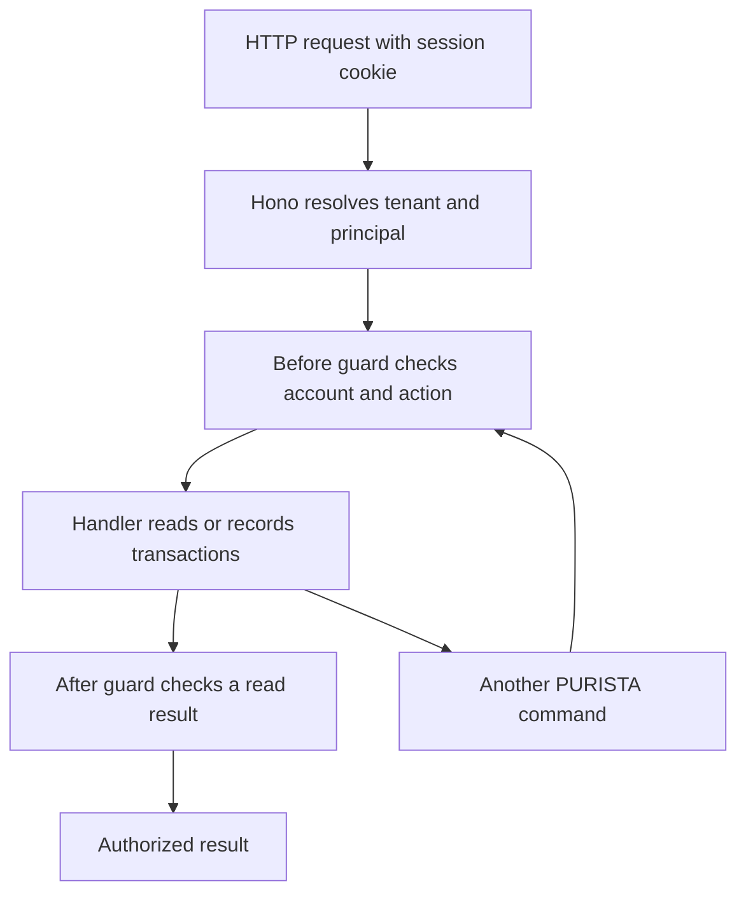

Bob helps Alice with her accounts. He may read account A, but he may not record
transactions or read Carol's account C. Logging in as Bob must not change those
rules. Dana is a posting operator: she may record transactions for her assigned
account while posting is enabled.

You will add these rules to the transaction API you built. First create a local
session store and an account permission resource. Then connect them to Hono,
add before and after guards, and generate a command that calls another guarded
command.

A **session** tells the server who is calling. A **business permission** says
what that person may do now. Keep these decisions separate: removing Bob's
permission must take effect while his session is still valid.

## Start here

Continue with the project from the transaction API chapter. If you arrived
directly, create that starting point with the
[independent setup instructions](/tutorials/authenticated-banking-ui/run-account-access/). No browser UI,
Docker service, or identity-provider account is required.

The local login accepts fictional actor names. **Anyone who can reach it can
choose any fixture actor.** Keep the server on its existing loopback address;
do not deploy this login or use it with real data. Session expiry and logout
are implemented, but password verification, production membership checks,
and a shared persistent session store are outside this local example.

## Build the chapter

1. [Prepare the existing transaction API](/tutorials/authenticated-banking-ui/run-account-access/).
2. [Create server-owned identities and sessions](/tutorials/authenticated-banking-ui/add-local-login/).
3. [Define account and action permissions](/tutorials/authenticated-banking-ui/model-account-permissions/).
4. [Test identity and permissions separately](/tutorials/authenticated-banking-ui/test-access-foundation/).
5. [Configure Hono authentication](/tutorials/authenticated-banking-ui/set-trusted-identity/).
6. [Separate transaction storage by tenant](/tutorials/authenticated-banking-ui/scope-transaction-storage/).
7. [Connect the resources and HTTP server](/tutorials/authenticated-banking-ui/wire-permission-resources/).
8. [Add guards for account actions](/tutorials/authenticated-banking-ui/guard-business-actions/).
9. [Protect returned history and keep bank information public](/tutorials/authenticated-banking-ui/check-results-and-calls/).
10. [Build an authenticated test client](/tutorials/authenticated-banking-ui/create-http-test-client/).
11. [Update and run the API tests](/tutorials/authenticated-banking-ui/update-api-tests/).
12. [Verify permissions and tenant isolation](/tutorials/authenticated-banking-ui/test-business-permissions/).
13. [Verify session expiry and logout](/tutorials/authenticated-banking-ui/test-session-boundary/).
14. [Test failures at the guard boundaries](/tutorials/authenticated-banking-ui/test-guard-boundaries/).
15. [Generate a command that calls another command](/tutorials/authenticated-banking-ui/generate-account-overview/).
16. [Verify downstream identity and try the API](/tutorials/authenticated-banking-ui/test-downstream-identity/).

The first four pages form a small, testable foundation. The following wiring
pages change connected files; keep the development server stopped until the
updated API tests pass. The final command is a separate runnable checkpoint.
