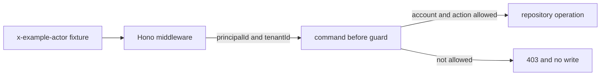

Everyone in this example can be selected as a local fixture actor. That does
not mean everyone may perform every action. Alice and Bob may read account A;
Carol may read account C; Dana may record an already-posted transaction for
account A. Bob may not post, even though Bob is a known actor.

The current source implements **business guards**, not production
authentication. `examples/banking/src/index.ts` uses the header as an explicit
local test switch. It has no cookie, session, OAuth/OIDC integration, login
screen, or logout route. Keep that limit visible whenever you run the example.

The service guards are in `examples/banking/src/service.ts`; their fixture
permissions live in `examples/banking/src/repository.ts`.

1. [Run the account access example](/tutorials/authenticated-banking-ui/run-account-access/)
2. [Understand the local login boundary](/tutorials/authenticated-banking-ui/add-local-login/)
3. [Inspect trusted identity handling](/tutorials/authenticated-banking-ui/set-trusted-identity/)
4. [Check account permissions with guards](/tutorials/authenticated-banking-ui/guard-business-actions/)
5. [Protect returned data](/tutorials/authenticated-banking-ui/check-results-and-calls/)
6. [Test access decisions](/tutorials/authenticated-banking-ui/test-business-permissions/)

Next: [run the account access example](/tutorials/authenticated-banking-ui/run-account-access/).
