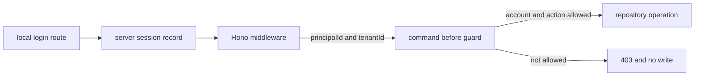

The local login can create a fixture session for several named tutorial
people. That does not mean each person may perform every action. Alice and Bob
may read account A; Carol may read account C; Dana may record an already-posted
transaction for account A. Bob may not post even after a valid local login.

The current source implements a local fixture login and **business guards**.
`examples/banking/src/index.ts` stores a randomly generated opaque session ID
in an HttpOnly cookie and looks up its principal and tenant on the server. The
React UI provides a matching login and logout screen. This remains a learning
fixture: it has no password verification, OAuth/OIDC integration, durable
session store, or production tenant-membership check. Keep that limit visible
whenever you run the example.

The service guards are in `examples/banking/src/service.ts`; their fixture
permissions live in `examples/banking/src/repository.ts`.

1. [Run the account access example](/tutorials/authenticated-banking-ui/run-account-access/)
2. [Understand the local login boundary](/tutorials/authenticated-banking-ui/add-local-login/)
3. [Inspect trusted identity handling](/tutorials/authenticated-banking-ui/set-trusted-identity/)
4. [Check account permissions with guards](/tutorials/authenticated-banking-ui/guard-business-actions/)
5. [Protect returned data](/tutorials/authenticated-banking-ui/check-results-and-calls/)
6. [Test access decisions](/tutorials/authenticated-banking-ui/test-business-permissions/)

Next: [run the account access example](/tutorials/authenticated-banking-ui/run-account-access/).
