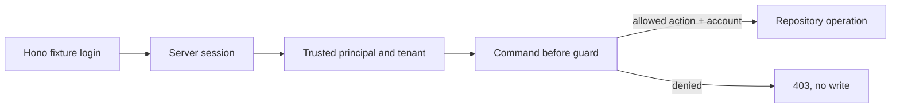

The API chapter proved that a command can accept and return transaction data.
This chapter answers a separate question: may this valid person use this
specific account for this specific action? Alice and Bob may read account A;
Dana may record a transaction for A; Bob may not post even after a valid local
login.



This is a learning-only local login. It accepts documented fixture names, keeps
an opaque session ID in an HttpOnly cookie, and looks up identity on the server.
It does not verify passwords, OAuth/OIDC tokens, session expiry, or production
tenant membership. Its purpose is to make the boundary before the business
guards visible.

## Start from generated commands

Create the banking service and the read command when you enter this chapter
directly. The next pages add the Hono identity adapter and the business guard;
they do not replace the generated command boundary.

```bash title="Generate the protected account-read command"
npm run add:service -- banking --description "Banking transaction operations"
npm run add:command -- list-transactions \
  --service banking --service-version 1 \
  --description "Return a caller-authorized transaction history"
```

The finished reference is in `examples/banking/src/index.ts`,
`examples/banking/src/service.ts`, and `examples/banking/src/repository.ts`.
Each page builds the same shape in the CLI-created application.

1. [Generate the protected read command](/tutorials/authenticated-banking-ui/run-account-access/)
2. [Add the local fixture login](/tutorials/authenticated-banking-ui/add-local-login/)
3. [Pass trusted identity to PURISTA](/tutorials/authenticated-banking-ui/set-trusted-identity/)
4. [Guard business actions](/tutorials/authenticated-banking-ui/guard-business-actions/)
5. [Check returned data](/tutorials/authenticated-banking-ui/check-results-and-calls/)
6. [Test access decisions](/tutorials/authenticated-banking-ui/test-business-permissions/)

Next: [generate the protected read command](/tutorials/authenticated-banking-ui/run-account-access/).
