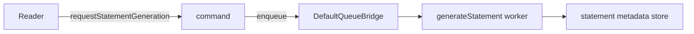

Some work should return a reference quickly and finish in a worker. This
checkpoint queues statement generation for an account reader. The worker counts
the account’s synthetic transactions and stores generated statement metadata.



The command and worker live in `examples/banking/src/advanced/service.ts`.
They use `DefaultQueueBridge`, an in-process and in-memory bridge. This
checkpoint does not generate a PDF, store bytes, expose a download, retain a
job after restart, or prove durable retry behavior.

## Start here

No Docker dependency is required. Start the full application if you want to
inspect the declared HTTP command, then run the focused tests for existing
behavior.

```bash title="Start the local banking application"
npm run dev -w @purista/banking-tutorials
```

1. [Compare a stream and a job](/tutorials/background-statements/compare-streams-and-jobs/)
2. [Define the queue and worker](/tutorials/background-statements/define-the-queue-worker/)
3. [Request statement generation](/tutorials/background-statements/request-statement-generation/)
4. [Write statement metadata](/tutorials/background-statements/write-statement-metadata/)
5. [Understand idempotency and limits](/tutorials/background-statements/understand-job-limits/)
6. [Test background work](/tutorials/background-statements/test-background-work/)
