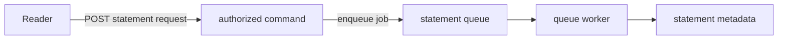

A statement can take longer than the browser should wait. In this chapter, a
reader asks for a statement and immediately receives a job reference. A
PURISTA queue worker later counts the account's transactions and stores small
statement metadata.

This is a **build** chapter. You create the queue and worker with the local
PURISTA CLI, replace its safe starter contracts, connect the existing banking
command, and write tests before moving on. The finished reference is in
`examples/banking/src/advanced/service.ts`; its focused tests are in
`examples/banking/src/advanced/service.test.ts`.



## Starting point

Use the project from the earlier banking chapters. It must already have a
`banking-operations` service at version `1`, a banking repository resource,
and a command that can identify the authenticated principal. If you are using
this chapter on its own, create the service once before the first step:

```bash title="Create the service when it does not exist yet"
npm run add:service -- banking-operations \
  --description "Banking operations and background work"
```

The generated project installs `@purista/cli` locally. Run the `npm run
add:*` scripts from the project root; do not copy a globally installed CLI
version into the tutorial.

The local `DefaultQueueBridge` used by the reference app is intentionally
in-memory. It proves the application shape, but does not retain jobs after a
restart or make a production retry guarantee.

1. [Choose a queue and generate its first worker](/tutorials/background-statements/compare-streams-and-jobs/)
2. [Replace the generated queue contract](/tutorials/background-statements/define-the-queue-worker/)
3. [Enqueue a statement from an authorized command](/tutorials/background-statements/request-statement-generation/)
4. [Implement the worker and its business guard](/tutorials/background-statements/write-statement-metadata/)
5. [Add a worker only when it has a distinct job](/tutorials/background-statements/understand-job-limits/)
6. [Test the queue boundary and worker](/tutorials/background-statements/test-background-work/)
