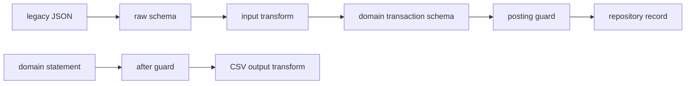

An external representation is not automatically the banking domain model. This
chapter keeps one domain transaction contract and accepts one documented legacy
shape at a separate HTTP endpoint. It also returns an authorized statement as
CSV without making CSV the command's business result.

The implemented source is `examples/banking/src/service.ts`. It supports only
EUR values with exactly two decimal digits and legacy debit/credit codes `D`
and `C`. It has no external HTTP client, mock bank server, Docker Compose
profile, account lookup, currency conversion, or row-by-row file import. This
chapter documents the real, local transform boundary that is available today.

1. [Compare the two formats](/tutorials/banking-integrations/compare-formats/)
2. [Transform legacy input](/tutorials/banking-integrations/transform-input/)
3. [Keep business guards](/tutorials/banking-integrations/keep-business-guards/)
4. [Export a statement](/tutorials/banking-integrations/transform-output/)
5. [Understand the external API boundary](/tutorials/banking-integrations/call-the-legacy-api/)
6. [Test transform boundaries](/tutorials/banking-integrations/test-transform-boundaries/)

Next: [compare the two formats](/tutorials/banking-integrations/compare-formats/).
