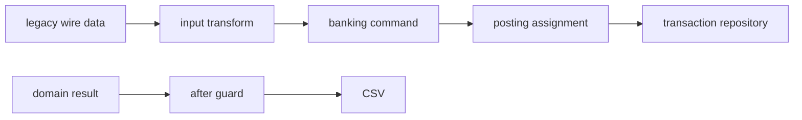

Your banking service owns one transaction language: minor currency units,
`accountId`, and `debit` or `credit`. A legacy bank uses another. In this
chapter you build a boundary that translates one supported legacy record into
the banking language, then exports an approved statement as CSV.



Start with the CLI-created banking service. If you are using this chapter on
its own, generate it first:

```bash title="Create the service"
npm run add:service -- banking --description "Banking transaction operations"
```

The runnable checkpoint is `examples/banking/src/service.ts`. Its
`LocalLegacyBankMock` is an in-process dependency, so this first integration
does not require Docker or an external account.

1. [Compare the two formats](/tutorials/banking-integrations/compare-formats/)
2. [Generate and transform legacy input](/tutorials/banking-integrations/transform-input/)
3. [Keep a business guard around the write](/tutorials/banking-integrations/keep-business-guards/)
4. [Export a statement safely](/tutorials/banking-integrations/transform-output/)
5. [Inject and inspect a local legacy-bank adapter](/tutorials/banking-integrations/call-the-legacy-api/)
6. [Test the boundary](/tutorials/banking-integrations/test-transform-boundaries/)
