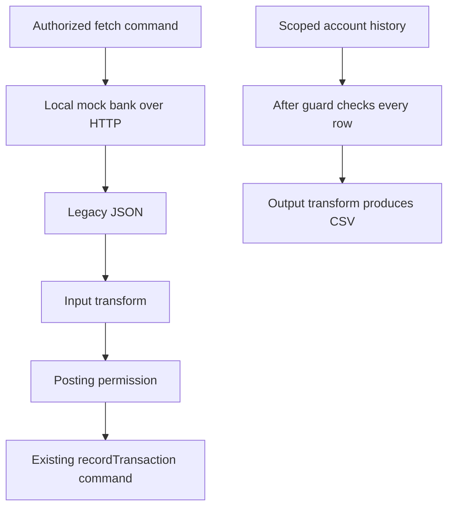

Your banking API accepts integer minor units and a direction such as
`debit`. A legacy bank sends a decimal string such as `"125.40"` and the
letter `D`. Both describe the same synthetic transaction. You will teach
PURISTA how to translate that representation without changing who may record it.

Then you will build a CSV export of permitted account history. Finally, you
will connect a separate mock bank over HTTP. That outbound request belongs in
a command handler, where account permissions can be checked before it runs.

## Where to begin

Continue from the `account-overview` checkpoint. If you arrived independently,
[recreate the starting project](/tutorials/banking-integrations/compare-formats/) before editing.
You need no UI, model provider, or external bank account. The first import and
CSV export use only the local application. Docker Compose appears when you
build the separate mock dependency.

The application already has trusted Hono identity, account/action permissions,
and tenant-scoped transaction storage. We will keep using them. A different
input format must not let Bob gain Dana's posting permission.

## Build the integration

1. [Prepare the project and compare the formats](/tutorials/banking-integrations/compare-formats/).
2. [Define the legacy contract and exact conversion](/tutorials/banking-integrations/define-legacy-format/).
3. [Generate and implement the import command](/tutorials/banking-integrations/transform-input/).
4. [Test conversion through the guarded runtime](/tutorials/banking-integrations/keep-business-guards/).
5. [Write a bounded CSV formatter](/tutorials/banking-integrations/serialize-csv/).
6. [Generate the statement export command](/tutorials/banking-integrations/transform-output/).
7. [Configure the HTTP download response](/tutorials/banking-integrations/download-statement/).
8. [Test CSV data and denied exports](/tutorials/banking-integrations/test-csv-export/).
9. [Build and start the mock bank](/tutorials/banking-integrations/call-the-legacy-api/).
10. [Write the outbound HTTP client](/tutorials/banking-integrations/add-legacy-client/).
11. [Inject the client as a service resource](/tutorials/banking-integrations/wire-legacy-client/).
12. [Generate the fetch-and-import command](/tutorials/banking-integrations/fetch-legacy-transaction/).
13. [Connect and test the complete HTTP flow](/tutorials/banking-integrations/test-transform-boundaries/).
14. [Try the integration and stop its dependency](/tutorials/banking-integrations/try-the-integration/).

The three runnable checkpoints are `legacy-import`, `csv-export`, and
`legacy-http`. Each is constructed by the preceding pages; they are also
available through the repository's replay script.
