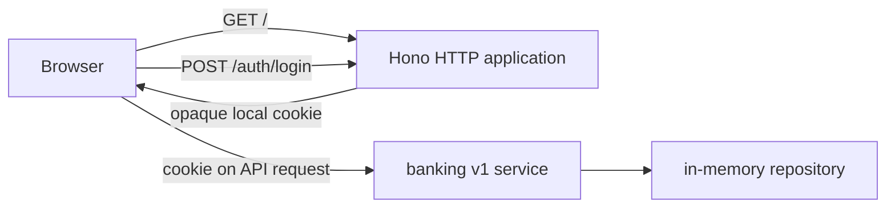

The first result is deliberately small: a browser receives a built React page
from a PURISTA application. The page names itself **Example Bank**, reminds you
that its data is synthetic, and starts a local fixture session before it calls
the transaction API. There is no database, broker, or model in this checkpoint.



The browser page is served by the Hono application in
`examples/banking/src/index.ts`. Choose a synthetic tutorial person in the
React login form, then select **Start local session**. Hono stores that fixture
identity in an in-memory server session and sends an opaque HttpOnly cookie.
The browser later sends the cookie with protected API requests. The banking
service and repository start in the same Node process, with deterministic data
for the pages that follow.

## Before you start

Use Node 24.15 or newer. Work from the `purista` repository root. The example
declares all of its own scripts and dependencies in
`examples/banking/package.json`.

```bash title="Start the Example Bank"
npm run dev -w @purista/banking-tutorials
```

Open `http://127.0.0.1:3010/`. Stop the foreground process with `Ctrl+C` when
you finish. Restarting the process creates fresh in-memory fixtures.

## Follow the current checkpoint

1. [Create and run the project](/tutorials/banking-ui/run-the-project/)
2. [Start the Hono HTTP server](/tutorials/banking-ui/start-hono/)
3. [Serve the browser page](/tutorials/banking-ui/serve-react/)
4. [Make your first visible change](/tutorials/banking-ui/change-the-page/)
5. [Build, run, and stop the application](/tutorials/banking-ui/build-and-stop/)

Hono serves the built React assets from `examples/banking/ui/dist`. The UI uses
local, default shadcn-compatible design tokens and calls the same generated
HTTP API used by the command-line examples. Its login is a local fixture: it
creates an opaque in-memory session for synthetic people, not a production
identity provider. The later API chapters use this same running application
rather than a hidden second service.

Next: [create and run the project](/tutorials/banking-ui/run-the-project/).
