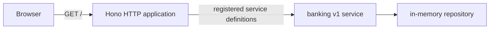

The first result is deliberately small: a browser receives a page from a
PURISTA application. There is no transaction form, database, login, broker, or
model in this checkpoint. The page names itself **Example Bank** and reminds
you that its data is synthetic.



The browser page is served by the Hono application in
`examples/banking/src/index.ts`. The banking service and repository start in
the same Node process. The repository is present so later API chapters have
deterministic data; this first page does not read it.

## Before you start

Use Node 24.15 or newer. Work from the `purista` repository root. The example
declares all of its own scripts and dependencies in
`examples/banking/package.json`.

```bash title="Start the Example Bank"
npm run dev -w @purista/banking-tutorials
```

Open `http://127.0.0.1:3010/`. Stop the foreground process with `Ctrl+C` when
you finish. Restarting the process creates fresh in-memory fixtures.

## Follow the current checkpoint

1. [Create and run the project](/tutorials/banking-ui/run-the-project/)
2. [Start the Hono HTTP server](/tutorials/banking-ui/start-hono/)
3. [Serve the browser page](/tutorials/banking-ui/serve-react/)
4. [Make your first visible change](/tutorials/banking-ui/change-the-page/)
5. [Build, run, and stop the application](/tutorials/banking-ui/build-and-stop/)

The current checkpoint serves one small HTML response from Hono. It does not
yet contain React assets or shadcn components, so this chapter does not pretend
that it does. The later API chapters use the same running application rather
than a hidden second service.

Next: [create and run the project](/tutorials/banking-ui/run-the-project/).
