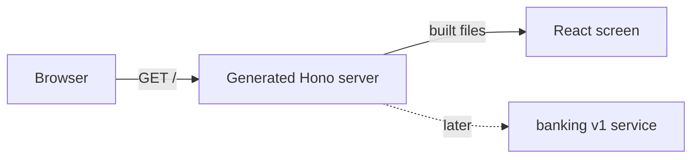

The first result is deliberately small: a browser receives a built React page
from the PURISTA application you created with the CLI. The page names itself
**Example Bank** and labels its data as synthetic. It has no login, REST
command, database, broker, or model yet.

Start from [the CLI-created project](/tutorials/start-a-purista-project/). If
you arrived here directly, create it first with `npm create purista@latest
example-bank`, choosing Node.js, the default EventBridge, Hono support, and
npm. The generator gives you `src/http.ts`; this chapter adds a browser build
to that server. The final reference files live in `examples/banking/ui`.

Use Node 24.15 or newer. Work in the `example-bank` project directory. No
Docker service, database, credentials, or model is needed.

1. [Prepare the browser project](/tutorials/banking-ui/run-the-project/)
2. [Read the generated Hono HTTP server](/tutorials/banking-ui/start-hono/)
3. [Serve the browser page](/tutorials/banking-ui/serve-react/)
4. [Make your first visible change](/tutorials/banking-ui/change-the-page/)
5. [Build, run, and stop the application](/tutorials/banking-ui/build-and-stop/)

Hono will serve the built React assets from `ui/dist`. The UI uses local,
default shadcn-compatible design tokens. The later chapters add a local fixture
login and generated HTTP commands; neither belongs in this first browser step.

Next: [prepare the browser project](/tutorials/banking-ui/run-the-project/).
