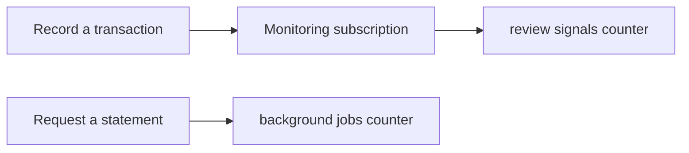

Operations teams need a short answer to questions such as “did the monitoring
rule record a signal?” and “did a statement request enter its queue?”. A counter metric
answers those questions over many runs. This chapter adds two bounded counters
to the existing banking operations service.

The metric labels deliberately use small fixed sets. They contain an outcome,
the training rule version, or the job kind. They do not contain an account,
person, transaction, tenant, request ID, or customer text.



This is a local runtime proof. The test injects an in-memory metrics recorder
and asserts the emitted records. It does not configure a telemetry exporter,
trace backend, log redaction policy, diagnostic UI, Docker Compose profile,
or an exporter-failure/shutdown path. A metric is not a durable business audit
record and it never grants access to a review case.

## Start here

Metrics extend generated work; they are not an independent service. Complete
the transaction-monitoring and background-statements chapters first, or create
the same operations artifacts in a fresh project:

```bash title="Generate the metric-producing PURISTA artifacts"
npm run add:service -- banking-operations --description "Monitoring and banking operations"
npm run add:subscription -- monitor-recorded-transaction \
  --service banking-operations --service-version 1 \
  --event banking.transaction.recorded \
  --description "Record a synthetic transaction review signal"
npm run add:queue -- generate-statement \
  --service banking-operations --service-version 1 \
  --worker-name generate-statement-worker --worker-mode continuous \
  --description "Generate statement metadata"
```

Add the metric declarations to that generated service builder, then update the
generated subscription and command tests to assert only finite labels.

Run the banking tests from the PURISTA repository root:

```bash title="Run the bounded metrics checkpoint"
npm run test -w @purista/banking-tutorials
```

1. [Run the metrics scenario](/tutorials/business-observability/run-traced-scenario/)
2. [Define safe metric contracts](/tutorials/business-observability/configure-safe-telemetry/)
3. [See where the counters are updated](/tutorials/business-observability/follow-operation/)
4. [Add bounded business metrics](/tutorials/business-observability/add-business-metrics/)
5. [Understand current limits](/tutorials/business-observability/diagnose-a-failure/)
6. [Test metric boundaries](/tutorials/business-observability/test-observability-boundaries/)
