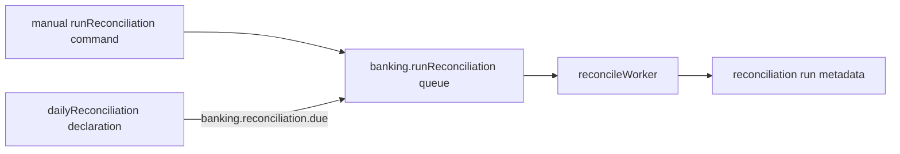

Reconciliation compares records and reports differences in a complete banking
application. The current local checkpoint establishes the orchestration shape
only: it queues a manual run, counts local transactions and monitoring
findings, then stores an in-memory run projection.



`examples/banking/src/advanced/service.ts` contains the command, queue worker,
schedule declaration, and event-to-queue binding. The schedule is metadata in
the running service. This example does not start a scheduler host, import a
settlement file, calculate a mismatch, or perform a financial correction.

## Start here

No Docker dependency is required. The local queue and event bridges are
in-memory teaching tools and do not prove durable occurrence handling.

```bash title="Run the reconciliation definition tests"
npm run test -w @purista/banking-tutorials
```

1. [Run a manual trigger](/tutorials/daily-reconciliation/run-a-manual-trigger/)
2. [Define the reconciliation contract](/tutorials/daily-reconciliation/define-the-reconciliation-contract/)
3. [Run the reconciliation worker](/tutorials/daily-reconciliation/run-the-reconciliation-worker/)
4. [Store one run per day](/tutorials/daily-reconciliation/store-one-run-per-day/)
5. [Declare a daily schedule](/tutorials/daily-reconciliation/declare-a-daily-schedule/)
6. [Test reconciliation boundaries](/tutorials/daily-reconciliation/test-reconciliation-boundaries/)
