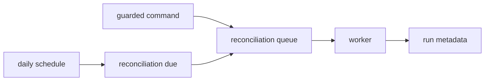

Reconciliation compares records and reports differences in a complete banking
application. This chapter builds the orchestration shape: a permitted operations
user queues a run, a worker counts local facts, and a schedule declares the
daily occurrence.



Use the earlier `banking-operations` service. If it does not exist, create it:

```bash title="Generate the operations service"
npm run add:service -- banking-operations \
  --description "Banking operations and background work"
```

The local queue and event bridges are in-memory teaching tools. They do not
prove durable scheduling or restart recovery. The checkpoint implementation is
`examples/banking/src/advanced/service.ts`.

1. [Generate the manual trigger](/tutorials/daily-reconciliation/run-a-manual-trigger/)
2. [Define the source-scoped contract](/tutorials/daily-reconciliation/define-the-reconciliation-contract/)
3. [Generate and implement the worker](/tutorials/daily-reconciliation/run-the-reconciliation-worker/)
4. [Make one run per source and day](/tutorials/daily-reconciliation/store-one-run-per-day/)
5. [Declare the daily schedule](/tutorials/daily-reconciliation/declare-a-daily-schedule/)
6. [Test the boundaries](/tutorials/daily-reconciliation/test-reconciliation-boundaries/)
