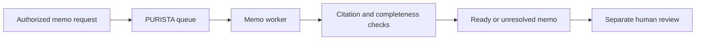

Dana prepares a synthetic fee-notice proposal. The service records a short
plan, approved citations, claims, named issues, and a review status. It does
not publish a policy change. A model, rubric, or passing test cannot grant
publication permission.



This local checkpoint uses deterministic application code and synthetic source
fixtures, so it has no provider key or model cost. It focuses on the durable
lesson: make the work artifact reviewable, keep evidence visible, bound retry
work, and leave a failed check unresolved.

## Generate the queue boundary

Create the service, request command, typed queue, and its worker before adding
the memo contracts. The queue is the work boundary; it is not a hidden helper
inside a request handler.

```bash title="Generate the decision-memo artifacts"
npm run add:service -- banking-decision-memos \
  --description "Create source-backed training decision memos"
npm run add:command -- request-decision-memo \
  --service banking-decision-memos --service-version 1 \
  --description "Queue one authorized source-backed decision memo"
npm run add:queue -- create-decision-memo \
  --service banking-decision-memos --service-version 1 \
  --worker-name create-decision-memo-worker --worker-mode continuous \
  --description "Create one source-backed training decision memo"
```

The generated artifacts give the request, queue, and worker their own
contracts and tests. Replace the safe starter schema with the request key,
approved source-set, and topic used below. The runnable checkpoint is
`examples/banking/src/memos/service.ts`.

```bash
npx vitest run examples/banking/src/memos/service.test.ts
```

1. [Request a memo](/tutorials/decision-memos/request-a-memo/)
2. [Make the plan and evidence visible](/tutorials/decision-memos/plan-and-retrieve/)
3. [Draft a typed memo](/tutorials/decision-memos/draft-memo/)
4. [Check claims and citations](/tutorials/decision-memos/review-draft/)
5. [Stop after a fixed revision budget](/tutorials/decision-memos/revise-with-budget/)
6. [Test the queue and review boundary](/tutorials/decision-memos/test-memo-workflow/)
