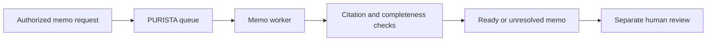

Dana prepares a synthetic fee-notice proposal. The service records a short
plan, approved citations, claims, named issues, and a review status. It does
not publish a policy change. A model, rubric, or passing test cannot grant
publication permission.



This local checkpoint uses deterministic application code and synthetic source
fixtures, so it has no provider key or model cost. It focuses on the durable
lesson: make the work artifact reviewable, keep evidence visible, bound retry
work, and leave a failed check unresolved.

```bash
npx vitest run examples/banking/src/memos/service.test.ts
```

1. [Request a memo](/tutorials/decision-memos/request-a-memo/)
2. [Make the plan and evidence visible](/tutorials/decision-memos/plan-and-retrieve/)
3. [Draft a typed memo](/tutorials/decision-memos/draft-memo/)
4. [Check claims and citations](/tutorials/decision-memos/review-draft/)
5. [Stop after a fixed revision budget](/tutorials/decision-memos/revise-with-budget/)
6. [Test the queue and review boundary](/tutorials/decision-memos/test-memo-workflow/)
