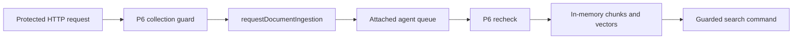

This checkpoint turns an approved bank document into searchable chunks. It is
a small PURISTA service with an attached agent queue. The agent has no live
model provider: its run function creates deterministic vectors so the test can
run without credentials, cost, or network access.

The main banking application registers this service in
`createBankingApplication()`. After you sign in with a local tutorial
session, select an account and press **Ingest sample guide** in the browser.
That button calls the generated document-ingestion command. The same local
session supplies the trusted tenant and principal to the service.



P6 is the business rule for this chapter: a caller may work only with a
collection they are allowed to read. In the fixture, Alice and Bob may use
`account-a-documents`; Carol may use `account-c-documents`. A valid
identity alone is not enough.

## Start here

No Docker service, database, vector store, or model provider is required. The
application uses `DefaultEventBridge`, `DefaultQueueBridge`, and an in-memory
repository, so all data disappears when the process stops.

Start the complete example from the PURISTA repository root:

```bash title="Build and start Example Bank"
npm run build:ui -w @purista/banking-tutorials
npm run dev -w @purista/banking-tutorials
```

Open `http://127.0.0.1:3010/`, start a local session as Alice, keep
**Account A** selected, and press **Ingest sample guide**. The UI reports that
the command was accepted; the local worker may need a moment before a
grounded-answer chat can retrieve it.

Run the focused proof as well:

```bash title="Run the focused ingestion proof from the PURISTA repository root"
npx vitest run examples/banking/src/knowledge/service.test.ts
```

The proof sends an allowed document through HTTP, the queue, and the attached
run function. It then searches the stored chunks. It also proves that a
cross-account or cross-tenant request returns `403` before the text reaches
the worker.

1. [Run the knowledge service](/tutorials/document-ingestion/run-knowledge/)
2. [Queue an authorized document](/tutorials/document-ingestion/queue-a-document/)
3. [Split text into searchable chunks](/tutorials/document-ingestion/split-source-text/)
4. [Store deterministic vectors](/tutorials/document-ingestion/store-embeddings/)
5. [Revise or remove a document](/tutorials/document-ingestion/change-documents/)
6. [Test ingestion boundaries](/tutorials/document-ingestion/test-ingestion/)
