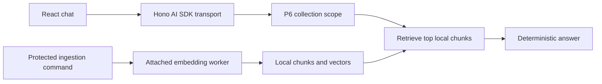

Someone asks a useful question: “What does my monthly statement explain?” The
application must first find the right account guide and check whether that
person may read it. Only then may it prepare an answer.

This chapter adds that path to the runnable Example Bank. A protected PURISTA
ingestion command puts a document on an attached agent queue. Its worker makes
repeatable tutorial vectors and stores chunks in the local repository. A
second PURISTA command retrieves the best permitted chunks and builds an
answer from their text. A small Hono route turns that answer into an AI SDK UI
message stream for the React chat panel.



P6 is the business rule in this chapter. A signed-in person may operate only
on the document collection for an account they are allowed to read. For the
synthetic fixtures, Alice and Bob may use `account-a-documents`; Carol may use
`account-c-documents`. Selecting a collection in the browser does not grant
permission to it.

## Build on the generated ingestion service

Complete the document-ingestion chapter first. It creates the `bankingKnowledge`
service, its guarded ingestion command, and the attached `embedDocument` agent.
Generate the answer command in that same service:

```bash title="Generate the grounded-answer command"
npm run add:command -- answer-knowledge-question \
  --service banking-knowledge --service-version 1 \
  --description "Answer from authorized stored excerpts"
```

Replace the command's starter schemas with `collectionId` and bounded
`question` fields, then reuse the collection business guard before calling the
retrieval helper. The React chat route remains a presentation adapter; the
PURISTA command owns authorization and answering.

## Run it locally

From the `purista` repository root, build the static React files once, then
start the application in a second terminal:

```bash title="Build the UI and start the banking example"
npm run build:ui -w @purista/banking-tutorials
npm run dev -w @purista/banking-tutorials
```

Open `http://127.0.0.1:3010/`, sign in as Alice or Bob, select Account A,
then choose **Ingest sample guide**. Wait for the confirmation message and ask
“What does a monthly statement explain?” The reply repeats text from the
stored guide.

No database, vector store, container, model provider, account, or credential
is needed. The example uses local in-memory bridges and a JavaScript `Map`.
Stopping the process removes documents, queue work, and sessions.

This is a working retrieval-and-answer flow, but it is deliberately not a live
AI system. It has no embedding model, no model-generated answer, no durable
external dependency, and no source-citation display beyond the returned answer
text. The deterministic vectors prove the plumbing, not semantic search
quality.

1. [Run the chat checkpoint](/tutorials/grounded-rag/run-grounded-chat/)
2. [Retrieve authorized excerpts](/tutorials/grounded-rag/retrieve-authorized-excerpts/)
3. [Build a deterministic grounded answer](/tutorials/grounded-rag/build-deterministic-grounded-answer/)
4. [Stream the answer to React](/tutorials/grounded-rag/stream-answer-to-react/)
5. [Understand the current RAG limits](/tutorials/grounded-rag/understand-current-rag-limits/)
6. [Test the full boundary](/tutorials/grounded-rag/test-grounded-answer-boundary/)
