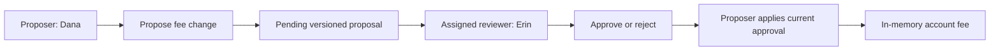

Some actions need a second person to decide. This checkpoint proposes a
synthetic fee change for `account-a`, assigns Erin as reviewer, and changes
the fee only after Erin approves the exact proposal version.

The main banking application registers this PURISTA service beside the other
banking services. Its generated endpoints use the same opaque local-session
middleware as the transaction API. There is not yet a browser fee-review
screen, so this chapter uses exact HTTP calls and integration tests to make
the business checkpoint visible.



P8 is the business rule. Dana may propose only an `account-a` change. The
reviewer must be assigned to that account and cannot be the proposer. A
decision and apply call must name the current version; an expired, rejected,
revised, or already-applied proposal cannot change the fee.

## Start here

No Docker service is required. The review store is in memory, so pending
proposals and fees reset when the test process ends.

```bash title="Run the main-app human-review proof from the PURISTA repository root"
npm run test -w @purista/banking-tutorials
```

1. [Run the review service](/tutorials/human-review/run-fee-review/)
2. [Propose a typed fee change](/tutorials/human-review/propose-fee-change/)
3. [Guard each review action](/tutorials/human-review/guard-review-actions/)
4. [Record a reviewer decision](/tutorials/human-review/record-decision/)
5. [Apply the current approval once](/tutorials/human-review/apply-approved-change/)
6. [Test review boundaries](/tutorials/human-review/test-review-boundaries/)
