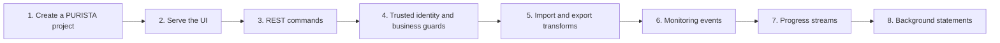

These tutorials build one small, synthetic banking application in steps. Start
with a new project created by the PURISTA CLI. Every time a chapter introduces
a service, command, subscription, stream, queue, worker, or agent, it first
shows the project-local `npm run add:*` command that creates the files. The
following step explains the generated code and the edit that gives it banking
meaning.

Each root topic is useful on its own. It names the problem, its independent
starting checkpoint, the files to change, and a check that proves the result.
The complete application is a reference after you have built a checkpoint, not
the starting point of the lesson.

The source lives in
[`examples/banking`](https://github.com/puristajs/purista/tree/master/examples/banking).
It uses synthetic accounts, money amounts, and review cases. It is a learning
application, not a payment, identity, compliance, or financial-advice system.



## Start the application

Start a new application anywhere on your development machine:

```bash title="Create an Example Bank project"
npm create purista@latest example-bank
cd example-bank
```

Choose Node.js, the default EventBridge, Hono support, and npm. The first
tutorial gives every choice and explains the generated project. The early
checkpoints use in-memory fixtures, so a restart resets their data.

## Choose a topic

| Topic | Problem you solve | PURISTA capability |
| --- | --- | --- |
| [Start an Example Bank project](/tutorials/start-a-purista-project/) | Create a project and generate the first service and command. | PURISTA CLI, services, commands |
| [Serve the banking UI](/tutorials/banking-ui/) | Put a small React UI behind the Hono composition root. | HTTP composition and static assets |
| [Build a transaction REST API](/tutorials/transaction-api/) | Read and record synthetic account transactions. | Resources, commands, schemas, HTTP endpoints |
| [Control access to accounts and actions](/tutorials/authenticated-banking-ui/) | Separate trusted identity from account-level business permissions. | Hono protection, command guards, output guards |
| [Import and export transaction data](/tutorials/banking-integrations/) | Normalize a legacy transaction and produce safe CSV. | Input and output transforms |
| [Monitor transactions](/tutorials/transaction-monitoring/) | React to a recorded transaction without delaying it. | Events and subscriptions |
| [Stream transaction analysis](/tutorials/streaming-analysis/) | Show bounded progress for an authorized review. | Streams |
| [Generate statements in background work](/tutorials/background-statements/) | Queue a statement and retrieve scoped metadata. | Queues and workers |
| [Automate daily reconciliation](/tutorials/daily-reconciliation/) | Define a repeat-safe reconciliation trigger and worker. | Schedule declaration and event-to-queue binding |
| [Remember a safe support preference](/tutorials/support-memory/) | Retain and delete one caller-owned language preference. | Attached workflows, Harness memory, business guards |
| [Protect an assistant with content boundaries](/tutorials/assistant-guardrails/) | Stop unsafe synthetic input, tool content, and output at the right runtime boundary. | Attached agents and native Harness interceptors |
| [Use agents with bank tools and Skills](/tutorials/agent-integrations/) | Add one guarded command lookup and a reviewed local support procedure. | Attached agents, command tools, Skills |
| [Investigate a case with parallel specialists](/tutorials/parallel-investigation/) | Combine three separately-scoped evidence questions into an honest review brief. | Attached workflows, local agents, bounded parallel fan-out |
| [Produce a source-backed decision memo](/tutorials/decision-memos/) | Create a reviewable policy proposal with citations and a fixed correction budget. | Queues, workers, schemas, idempotent artifacts |
| [Keep a policy wiki up to date](/tutorials/living-policy-wiki/) | Review and publish only an exact, source-backed wiki revision. | Commands, business guards, conflict handling, separate indexing |
| [Measure AI quality safely](/tutorials/ai-evaluations/) | Gate saved synthetic candidates without letting quality scores override access rules. | Typed fixtures, deterministic scoring, test gates |
| [Analyze a statement in a sandbox](/tutorials/sandboxed-analysis/) | Queue a synthetic CSV for a bounded local Docker analysis. | Commands, guards, queues, real sandbox lifecycle |
| [Prepare distributed banking dependencies](/tutorials/distributed-banking/) | Start local NATS, Redis, and PostgreSQL services and create the matching PURISTA bridges. | NATS and Redis bridges, Compose, explicit ownership |

The next roots extend the same application with business observability,
service-attached classification, ingestion, grounded answers, guardrails,
memory, human review, decision memos, evaluations, and distributed operation.
A later topic appears here only after its runnable checkpoint and source proof
exist.

## How the series stays trustworthy

Every security-looking example makes its business decision visible. A known
actor does not automatically gain access: account readers, transaction
posters, reviewers, queue workers, and result downloads each apply their own
business rule. Transforms change a representation; they never replace a
business guard. The automated tests include both an allowed case and a denied
case that checks no protected side effect was released.

The published source is checked in at
[`examples/banking`](https://github.com/puristajs/purista/tree/master/examples/banking).
It is the complete reference implementation and the test target for the
series. Tutorial steps build toward the same composition with small, explained
changes.
