Build the backend of **Example Bank**, a fictional bank. Begin with an empty
directory. Create a PURISTA project, install and configure its HTTP server, and
implement a command. Then give that application transaction history, account
permissions, background work, and AI-assisted support.

These are implementation lessons: each change has a reason, a destination file,
and a result you can check. You will use the project-local PURISTA CLI to create
services and operations, then replace their placeholders with business logic.

The frontend is optional. You can build and test the backend with your editor,
terminal, and HTTP requests. Early chapters require no database, broker, or model.

```mermaid title="The backend learning path"
flowchart LR
  Project["Create project"] --> HTTP["Install and configure Hono"]
  HTTP --> Command["First service and command"]
  Command --> API["Store transactions"]
  API --> Guards["Authorize account actions"]
  Guards --> Transform["Translate external formats"]
  Transform --> Events["React with subscriptions"]
  Events --> Jobs["Streams and background work"]
  Jobs --> AI["Service-attached AI"]
```

## Begin building

[Build your first PURISTA HTTP service](/tutorials/start-a-purista-project/)
takes you from project generation to `GET /api/v1/bank`. It shows package
installation, configuration, every startup file, CLI generation, the handler,
and an HTTP integration test.

Keep your project between chapters. When entering a chapter independently, use
its stated starting checkpoint; you do not need another chapter's process or
database running. Each chapter then explains the new work from that starting
point.

## Choose the problem to solve

| Chapter | What you build |
| --- | --- |
| [First HTTP service](/tutorials/start-a-purista-project/) | Generate the project and service; install Hono; implement and test a command. |
| [Transaction REST API](/tutorials/transaction-api/) | Define transaction schemas, inject a repository, record transactions, and read history. |
| [Account access](/tutorials/authenticated-banking-ui/) | Derive trusted identity and guard account actions for different valid users. |
| [Import and export](/tutorials/banking-integrations/) | Translate an external format and produce an authorized statement with transforms. |
| [Transaction monitoring](/tutorials/transaction-monitoring/) | Publish business events and handle them in a separate subscription. |
| [Progress streams](/tutorials/streaming-analysis/) | Return incremental transaction-analysis progress. |
| [Background statements](/tutorials/background-statements/) | Enqueue work, implement a worker, and retrieve its result. |
| [Daily reconciliation](/tutorials/daily-reconciliation/) | Connect an external time trigger to a repeat-safe reconciliation job. |
| [Business observability](/tutorials/business-observability/) | Measure business outcomes without exposing transaction data. |
| [Request classification](/tutorials/request-triage/) | Attach an agent to a service and classify support requests into a typed result. |
| [Document ingestion](/tutorials/document-ingestion/) | Validate, prepare, and index approved knowledge. |
| [Grounded answers](/tutorials/grounded-rag/) | Retrieve approved sources and answer questions with citations. |
| [Assistant guardrails](/tutorials/assistant-guardrails/) | Check assistant input, tool content, and output at the relevant boundaries. |
| [Support memory](/tutorials/support-memory/) | Remember and delete a caller-owned preference. |
| [Agent tools and Skills](/tutorials/agent-integrations/) | Give an attached agent scoped operations and reviewed instructions. |
| [Human review](/tutorials/human-review/) | Require a permitted reviewer before applying an account change. |
| [Parallel investigation](/tutorials/parallel-investigation/) | Combine scoped specialist results inside a Framework workflow. |
| [Decision memos](/tutorials/decision-memos/) | Produce and review a source-backed proposal. |
| [Policy wiki](/tutorials/living-policy-wiki/) | Review a revision before publishing and indexing it. |
| [AI evaluations](/tutorials/ai-evaluations/) | Test candidate quality without letting scores override access rules. |
| [Sandboxed analysis](/tutorials/sandboxed-analysis/) | Run bounded analysis in a local Docker sandbox. |
| [Distributed dependencies](/tutorials/distributed-banking/) | Wire brokers and stores explicitly for separate processes. |
| [Optional banking UI](/tutorials/banking-ui/) | Add a browser interface after the backend works. |

All AI examples belong to PURISTA services. Harness supplies their attached
runtime; there is no separate standalone Harness application in this series.

## Source and boundaries

The [tutorial source](https://github.com/puristajs/purista/tree/master/examples/banking/tutorial)
contains the build checkpoints and replay instructions. Its README states
which chapters the replay currently covers. The combined demo under
`examples/banking/src` is a separate reference; running it does not replace
building the application in these lessons.

Use synthetic data only. Recording a transaction does not move money.
Monitoring rules create review signals, not findings of financial crime.
An authenticated identity does not grant permission to every account or action:
business guards make those decisions explicit.
