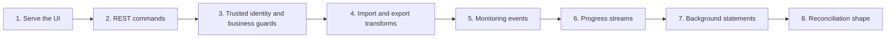

These tutorials build one small, synthetic banking application in steps. Each
root topic is useful on its own: it states the problem, gives one command to
start from, explains the code in plain English, and finishes with a check you
can run. Taken in order, the topics form one application rather than a set of
unrelated snippets.

The source lives in
[`examples/banking`](https://github.com/puristajs/purista/tree/master/examples/banking).
It uses synthetic accounts, money amounts, and review cases. It is a learning
application, not a payment, identity, compliance, or financial-advice system.



## Start the application

From the PURISTA repository root, build the browser UI and start the local
server:

```bash title="Build and start Example Bank"
npm run build:ui -w @purista/banking-tutorials
npm run dev -w @purista/banking-tutorials
```

Open `http://127.0.0.1:3010/`. Stop the process with `Ctrl+C` when you finish.
The first checkpoints use in-memory fixtures, so a restart resets their data.

## Choose a topic

| Topic | Problem you solve | PURISTA capability |
| --- | --- | --- |
| [Serve the banking UI](/tutorials/banking-ui/) | Put a small React UI behind the Hono composition root. | HTTP composition and static assets |
| [Build a transaction REST API](/tutorials/transaction-api/) | Read and record synthetic account transactions. | Resources, commands, schemas, HTTP endpoints |
| [Control access to accounts and actions](/tutorials/authenticated-banking-ui/) | Separate trusted identity from account-level business permissions. | Hono protection, command guards, output guards |
| [Import and export transaction data](/tutorials/banking-integrations/) | Normalize a legacy transaction and produce safe CSV. | Input and output transforms |
| [Monitor transactions](/tutorials/transaction-monitoring/) | React to a recorded transaction without delaying it. | Events and subscriptions |
| [Stream transaction analysis](/tutorials/streaming-analysis/) | Show bounded progress for an authorized review. | Streams |
| [Generate statements in background work](/tutorials/background-statements/) | Queue a statement and retrieve scoped metadata. | Queues and workers |
| [Automate daily reconciliation](/tutorials/daily-reconciliation/) | Define a repeat-safe reconciliation trigger and worker. | Schedule declaration and event-to-queue binding |
| [Remember a safe support preference](/tutorials/support-memory/) | Retain and delete one caller-owned language preference. | Attached workflows, Harness memory, business guards |
| [Protect an assistant with content boundaries](/tutorials/assistant-guardrails/) | Stop unsafe synthetic input, tool content, and output at the right runtime boundary. | Attached agents and native Harness interceptors |
| [Use agents with bank tools and Skills](/tutorials/agent-integrations/) | Add one guarded command lookup and a reviewed local support procedure. | Attached agents, command tools, Skills |

The next roots extend the same application with business observability,
service-attached classification, ingestion, grounded answers, guardrails,
memory, tools, human review, workflows, evaluations, and distributed
operation. A later topic appears here only after its runnable checkpoint and
source proof exist.

## How the series stays trustworthy

Every security-looking example makes its business decision visible. A known
actor does not automatically gain access: account readers, transaction
posters, reviewers, queue workers, and result downloads each apply their own
business rule. Transforms change a representation; they never replace a
business guard. The automated tests include both an allowed case and a denied
case that checks no protected side effect was released.
