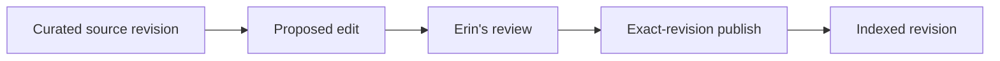

A policy source changes. The current wiki must not change immediately. Dana
creates a proposal, Erin reviews it, then Dana publishes only the exact source
and page revisions that were reviewed. Indexing is one more separate state.



The example uses in-memory fixtures and deterministic text. It teaches P9:
approval binds to the reviewed source and target revisions. A later source or
wiki-page change causes a conflict and requires a new review.

## Generate the versioned wiki commands

Create the service and commands before you add the revision store. Each command
is a distinct state transition, so its guard and test can name the exact actor
and revision it protects.

```bash title="Generate the policy-wiki service and first commands"
npm run add:service -- banking-policy-wiki \
  --description "Maintain reviewed synthetic banking policy guidance"
npm run add:command -- ingest-policy-source-change \
  --service banking-policy-wiki --service-version 1 \
  --description "Record one curated policy-source revision"
npm run add:command -- propose-policy-wiki-edit \
  --service banking-policy-wiki --service-version 1 \
  --description "Propose a source-backed policy wiki edit"
npm run add:command -- publish-policy-wiki-edit \
  --service banking-policy-wiki --service-version 1 \
  --description "Publish one exact approved wiki revision"
```

Generate decision and indexing commands in the same service as you reach those
steps. The runnable checkpoint is `examples/banking/src/wiki/service.ts`.

```bash
npx vitest run examples/banking/src/wiki/repository.test.ts examples/banking/src/wiki/service.test.ts
```

1. [Run the seeded wiki](/tutorials/living-policy-wiki/run-the-wiki/)
2. [Ingest a source change](/tutorials/living-policy-wiki/ingest-source-change/)
3. [Find the stale guidance](/tutorials/living-policy-wiki/find-stale-guidance/)
4. [Propose a wiki edit](/tutorials/living-policy-wiki/propose-wiki-edit/)
5. [Review and publish](/tutorials/living-policy-wiki/review-and-publish/)
6. [Index and test the revision](/tutorials/living-policy-wiki/reindex-and-test/)
