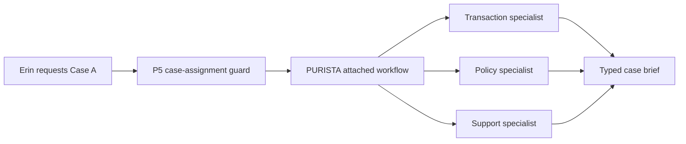

Erin investigates a synthetic review case. Three specialists answer three
different questions at the same time. The workflow returns one short case
brief. It does not freeze an account, accuse a customer, or make a compliance
decision.



This is a separate, runnable Hono service test. The parent banking UI remains
the place to learn the earlier interactive checkpoints. Here the specialists
are deterministic so the lesson runs without a provider key or model spend.
Later chapters can replace a specialist with a model-backed agent without
changing the P5 guard or the brief contract.

Run the proof from the repository root:

```bash
npx vitest run examples/banking/src/investigation/service.test.ts
```

1. [Run an assigned investigation](/tutorials/parallel-investigation/run-investigation/)
2. [Define narrow specialists](/tutorials/parallel-investigation/define-specialists/)
3. [Attach the coordinating workflow](/tutorials/parallel-investigation/coordinate-work/)
4. [Bound the parallel work](/tutorials/parallel-investigation/run-parallel-tasks/)
5. [Return an honest partial brief](/tutorials/parallel-investigation/combine-evidence/)
6. [Test scope and failure](/tutorials/parallel-investigation/test-delegation/)
