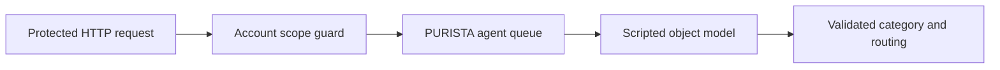

Customer support requests often need a short, structured category before a
human or application-owned workflow decides what happens next. This checkpoint
uses a PURISTA service-attached agent to classify one request for an account the
caller may read.

It is a deterministic, isolated service proof. The source starts a dedicated
service with `createScriptedHarnessModel()` in a test. It is not registered in
the main banking application, the browser UI has no support form, and the
example does not call a live model provider.



The agent can return one of three categories: `account-access`, `card-payment`,
or `other`. The application then returns either a permitted future-routing
destination or `no-action`. No command, queue job, tool, or account mutation is
started from model output.

## Start here

Run the focused proof from the PURISTA repository root:

```bash title="Run the attached agent test"
npx vitest run examples/banking/src/ai/customer-support-classification.test.ts
```

The test starts the real agent definition and generated Hono endpoint with a
scripted model. It proves a permitted account request reaches the model and an
out-of-scope account receives `403` before its text reaches the model.

1. [Run the isolated support proof](/tutorials/request-triage/run-support/)
2. [Attach the classification agent](/tutorials/request-triage/attach-classifier/)
3. [Bind the scripted model](/tutorials/request-triage/bind-model/)
4. [Route the structured result](/tutorials/request-triage/route-classification/)
5. [Handle low confidence and review](/tutorials/request-triage/handle-uncertainty/)
6. [Test the triage boundary](/tutorials/request-triage/test-triage/)
