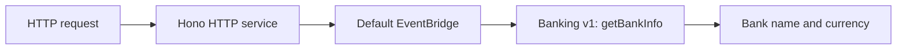

Start with an empty directory and build a small backend for **Example Bank**.
By the end, a request to `GET /api/v1/bank` returns the bank's name and
currency. You will write the code that makes that happen, including startup
and shutdown. You do not need React, Docker, a database, or an AI account.

You need basic TypeScript knowledge and a terminal. We explain PURISTA concepts
as they appear. The bank and all later transactions are fictional; this series
does not build a payment processor.

Hono accepts web requests. The EventBridge carries a request to a PURISTA
command. A command is a named operation with an input, an output, and the
function that performs the work. The Banking service groups our bank's
operations. First we connect these parts; then we give them behavior.

Follow these pages in order:

1. [Create a project and check the compiler](/tutorials/start-a-purista-project/create-project/).
2. [Find the generated startup and service files](/tutorials/start-a-purista-project/read-generated-project/).
3. [Install the HTTP packages](/tutorials/start-a-purista-project/install-hono/).
4. [Configure the local server](/tutorials/start-a-purista-project/configure-hono/).
5. [Connect and start Hono](/tutorials/start-a-purista-project/start-hono/).
6. [Generate and start the Banking service](/tutorials/start-a-purista-project/generate-banking-service/).
7. [Generate and implement the bank information command](/tutorials/start-a-purista-project/generate-first-command/).
8. [Test the complete request](/tutorials/start-a-purista-project/check-generated-checkpoint/).

Every file block states its destination. “Create” means add a new file;
“replace” means replace that file's entire contents. Run terminal commands
from the generated `example-bank` directory unless the page says otherwise.
Keep the same project between pages.

The [source checkpoints](https://github.com/puristajs/purista/tree/master/examples/banking/tutorial)
contain these exact edits and a replay script. They are a recovery aid, not a
prerequisite for following the lessons. The combined banking demo is separate
from this step-by-step source.

Begin with [create the project](/tutorials/start-a-purista-project/create-project/).
