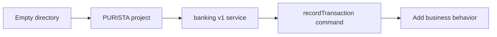

Before the browser UI or REST API, create the application that will own them.
This chapter starts from an empty directory. It uses the real PURISTA CLI, so
the files on your machine have the same structure as the files used by the
later tutorials.

The result is small on purpose: a Node application with Hono support, the
default in-process EventBridge, and a generated `banking` version 1 service.
The service then receives a generated `recordTransaction` command. Its handler
does nothing useful yet; the next chapters turn that safe placeholder into a
visible banking application.

This is a fictional bank. Use only the synthetic accounts and amounts supplied
by the tutorial. Nothing here processes a payment or implements real banking
security.

1. [Create the project](/tutorials/start-a-purista-project/create-project/)
2. [Read the generated project](/tutorials/start-a-purista-project/read-generated-project/)
3. [Generate the banking service](/tutorials/start-a-purista-project/generate-banking-service/)
4. [Generate the first command](/tutorials/start-a-purista-project/generate-first-command/)
5. [Check the generated checkpoint](/tutorials/start-a-purista-project/check-generated-checkpoint/)

Next: [create the project](/tutorials/start-a-purista-project/create-project/).
