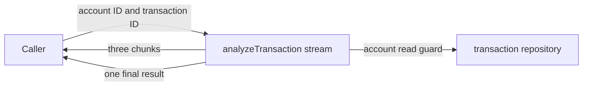

Some work produces useful progress before it has a final answer. The local
example defines a finite stream for reviewing one transaction. It emits three
small progress chunks and then one final result.



The stream is defined in `examples/banking/src/advanced/service.ts`. It has an
HTTP stream declaration, but the current checkpoint has no React screen or
browser transport test. Its focused test uses PURISTA’s stream context helper
to verify the handler output.

## Start here

No broker, Docker service, or AI model is needed. The stream checks a
deterministic in-memory transaction; it does not make an AI decision.

```bash title="Run the stream definition tests"
npm run test -w @purista/banking-tutorials
```

1. [Run the stream checkpoint](/tutorials/streaming-analysis/run-the-stream-checkpoint/)
2. [Define chunks and a final result](/tutorials/streaming-analysis/define-stream-results/)
3. [Protect the stream](/tutorials/streaming-analysis/protect-the-stream/)
4. [Write progress frames](/tutorials/streaming-analysis/write-progress-frames/)
5. [Handle missing transactions](/tutorials/streaming-analysis/handle-stream-failures/)
6. [Test the stream lifecycle](/tutorials/streaming-analysis/test-stream-lifecycle/)
