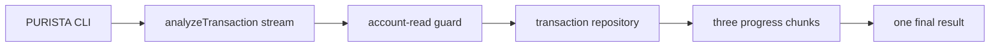

A command returns one answer. A stream can show small, useful updates while
work is still happening. In this chapter, an authorized bank employee asks for
a short review of one transaction. The service sends three progress chunks and
one final result.

This is deliberately a **short, connected** review. It does not make an AML
decision, retry work after a disconnect, or keep progress for later replay.
Those needs belong to the queue and worker chapters.



## Starting point

Start with the PURISTA project from [Start an Example Bank
project](/tutorials/start-a-purista-project/). This chapter adds the stream to
the `banking-operations` version 1 service. If you have not created that
service yet, create it first:

```bash title="Create the service checkpoint"
npm run add:service -- banking-operations --description "Example Bank monitoring and operations"
```

Then generate the stream itself. The step pages explain the generated files and
the focused changes in detail.

```bash title="Generate analyzeTransaction"
npm run add:stream -- analyze-transaction --description "Stream a short, bounded transaction review" --service banking-operations --service-version 1
```

The final runnable reference keeps this service in
`examples/banking/src/advanced/service.ts` and its focused tests in
`examples/banking/src/advanced/service.test.ts`. A fresh CLI project uses the
same builder API in `src/service/bankingOperations/v1/`.

## Build the stream in six small steps

1. [Generate the stream checkpoint](/tutorials/streaming-analysis/run-the-stream-checkpoint/)
2. [Define chunks and a final result](/tutorials/streaming-analysis/define-stream-results/)
3. [Protect the stream](/tutorials/streaming-analysis/protect-the-stream/)
4. [Write progress frames](/tutorials/streaming-analysis/write-progress-frames/)
5. [Reject a missing transaction safely](/tutorials/streaming-analysis/handle-stream-failures/)
6. [Test the stream lifecycle](/tutorials/streaming-analysis/test-stream-lifecycle/)

Each page repeats the generator command. You can use a page on its own when
your project has the `banking-operations` service and the small transaction
repository from the earlier transaction chapters.
