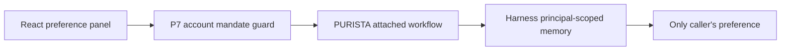

A returning customer wants their support language remembered. That sounds
small, but a copied browser conversation id must never reveal another
customer's data. This chapter stores only `en` or `de`; it never stores an
account balance, a permission, or a fact used to make a banking action.



P7 is the business rule: the signed-in person must be allowed to read the
selected account before the workflow reaches memory. Harness then scopes the
record by tenant and principal. The conversation id is only a label inside
that caller-owned scope.

## Generate the three memory workflows

Create the service and each attached workflow with the local PURISTA CLI. Each
workflow gets its own generated builder and test because saving, reading, and
deleting have different effects.

```bash title="Generate the support-memory service and workflows"
npm run add:service -- banking-support-memory \
  --description "Store caller-owned support preferences"
npm run add:agent -- save-support-preference --service banking-support-memory --service-version 1 \
  --description "Save one consented support-language preference"
npm run add:agent -- read-support-preference --service banking-support-memory --service-version 1 \
  --description "Read one caller-owned support-language preference"
npm run add:agent -- forget-support-preference --service banking-support-memory --service-version 1 \
  --description "Delete one caller-owned support-language preference"
```

Replace their starter contracts with `accountId`, a UUID conversation label,
and the allowlisted language value. Add the same account-mandate guard before
each generated workflow. The runnable checkpoint is
`examples/banking/src/memory/service.ts`.

The runnable UI is at `http://127.0.0.1:3010/`. Sign in as Alice, select
Account A, and use **Remember a support preference**. Choose **Restore
preference** after a page reload, then use **Forget preference** to delete it.

The local engine is in memory. Its 24-hour retention is part of the record,
but stopping the Node process removes it immediately. This chapter does not
claim durable restart behavior, chat-history retention, model calls, or
long-term profiling.

1. [Protect the conversation reference](/tutorials/support-memory/own-a-conversation/)
2. [Keep chat history out of this checkpoint](/tutorials/support-memory/limit-history/)
3. [Store a bounded preference](/tutorials/support-memory/remember-preferences/)
4. [Restore the preference](/tutorials/support-memory/resume-support/)
5. [Delete retained data](/tutorials/support-memory/forget-data/)
6. [Test memory scope](/tutorials/support-memory/test-memory-scope/)
