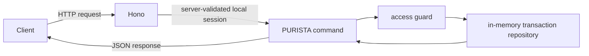

This chapter turns the local banking service into a small HTTP API. Dana records
an already-posted synthetic transaction for account A. Alice and Bob can read
account A; Carol can read account C. Recording a transaction here does not move
money and a customer cannot create a credit.



The current runnable source is in `examples/banking/src/service.ts`; its HTTP
composition is in `examples/banking/src/index.ts`. Start a local fixture
session through `/auth/login`; protected routes derive the principal and tenant
from its server-side record. This is not a production identity provider. The
next chapter explains the business permission rules that the API already
exercises.

## Start here

```bash title="Run the transaction API"
npm run dev -w @purista/banking-tutorials
```

Then follow the pages in order, or start any page with this command and the
example's deterministic fixtures.

1. [Run the API](/tutorials/transaction-api/run-the-api-start/)
2. [Define transactions](/tutorials/transaction-api/define-transactions/)
3. [Record a transaction](/tutorials/transaction-api/record-a-transaction/)
4. [Call the REST API](/tutorials/transaction-api/connect-rest/)
5. [Handle API errors](/tutorials/transaction-api/handle-api-errors/)
6. [Test the API](/tutorials/transaction-api/test-the-api/)

Next: [run the API](/tutorials/transaction-api/run-the-api-start/).
