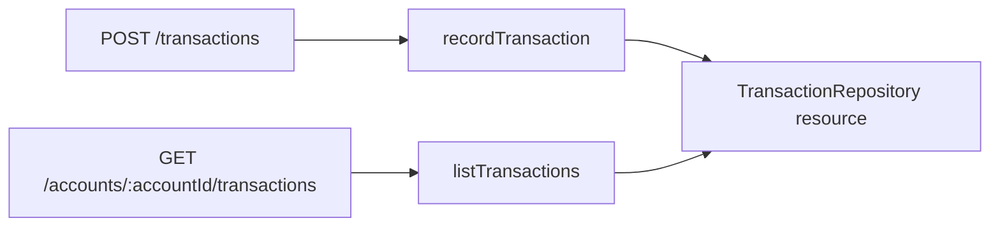

A bank operations system needs to record transactions that have already
happened and read their history. In this chapter you will build both operations
inside a PURISTA service, expose them over HTTP, and prove they share the same
storage.

Recording here does **not** transfer money or change a balance. All accounts
and transactions are synthetic.

Begin with the first chapter's `first-command` checkpoint: a Banking service,
Hono server, and working `GET /api/v1/bank`. You can continue in your own
project or [recreate that starting point](/tutorials/transaction-api/run-the-api-start/).
No frontend or external service is required.

You will make these changes:

1. [Prepare the existing project](/tutorials/transaction-api/run-the-api-start/).
2. [Describe a transaction with schemas](/tutorials/transaction-api/define-transactions/).
3. [Implement in-memory storage](/tutorials/transaction-api/add-repository/).
4. [Declare and inject the repository resource](/tutorials/transaction-api/wire-repository/).
5. [Update the HTTP test setup](/tutorials/transaction-api/test-resource-wiring/).
6. [Generate and implement the record command](/tutorials/transaction-api/record-a-transaction/).
7. [Generate and implement the history command](/tutorials/transaction-api/connect-rest/).
8. [Inspect invalid input and conflicts](/tutorials/transaction-api/handle-api-errors/).
9. [Check the complete application](/tutorials/transaction-api/test-the-api/).

The repository is process-local: restarting the application clears it. Keep
the server bound to `127.0.0.1`. The following chapter adds trusted identity
and business authorization before we treat any caller as an account user.
