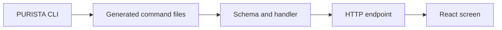

This chapter turns the generated `banking` service into a small HTTP API. An
operations actor records an already-posted synthetic transaction; an account
reader retrieves that account's history. Recording does not move money and a
customer cannot create a credit.

Start from [Start an Example Bank project](/tutorials/start-a-purista-project/).
Every page restates its generator command, so you can also create the same
`banking` version 1 checkpoint in a fresh PURISTA project. The final runnable
reference is `examples/banking/src/service.ts`; its browser integration is in
`examples/banking/ui`.

This first API uses an in-memory repository. Restarting the Node process resets
its synthetic data. Authentication and account-level business permissions are
added in the next root topic; do not treat a temporary local API as a payment
or public banking interface.

1. [Generate the API checkpoint](/tutorials/transaction-api/run-the-api-start/)
2. [Define the transaction contract](/tutorials/transaction-api/define-transactions/)
3. [Implement the record command](/tutorials/transaction-api/record-a-transaction/)
4. [Expose commands through REST](/tutorials/transaction-api/connect-rest/)
5. [Return safe API errors](/tutorials/transaction-api/handle-api-errors/)
6. [Test the API](/tutorials/transaction-api/test-the-api/)

Next: [generate the API checkpoint](/tutorials/transaction-api/run-the-api-start/).
